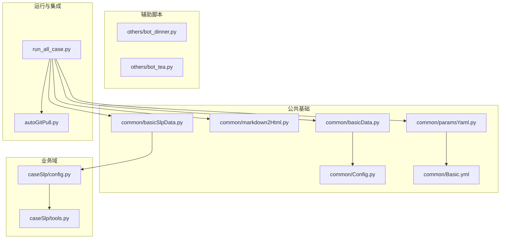
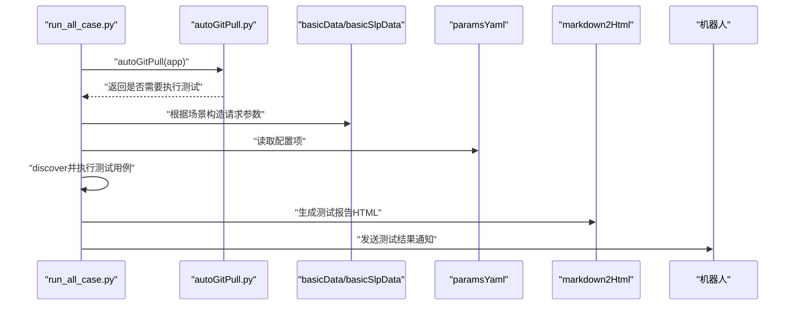
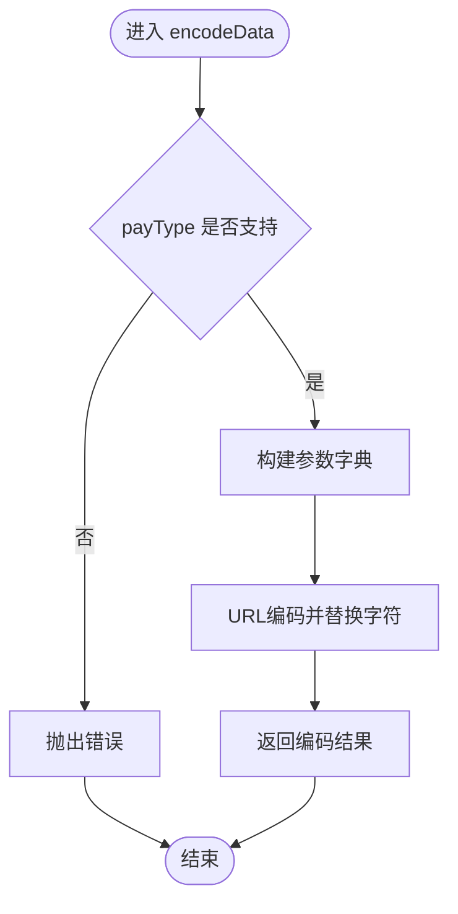
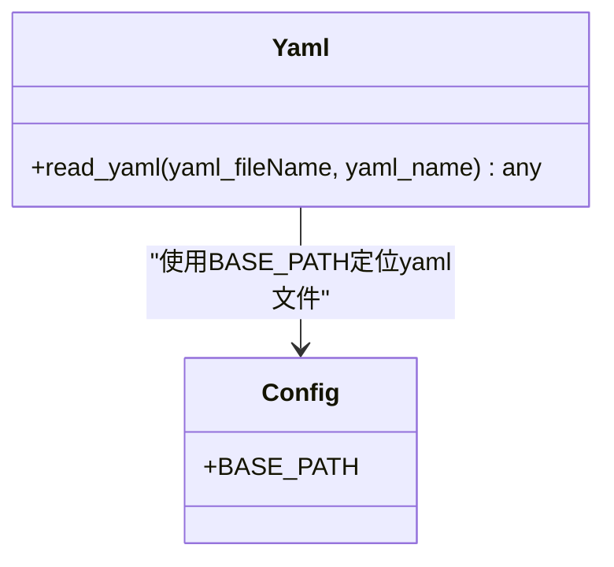
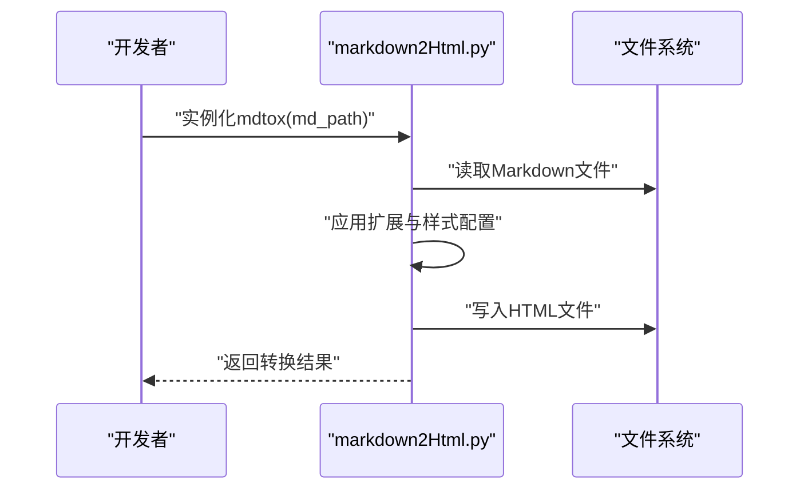
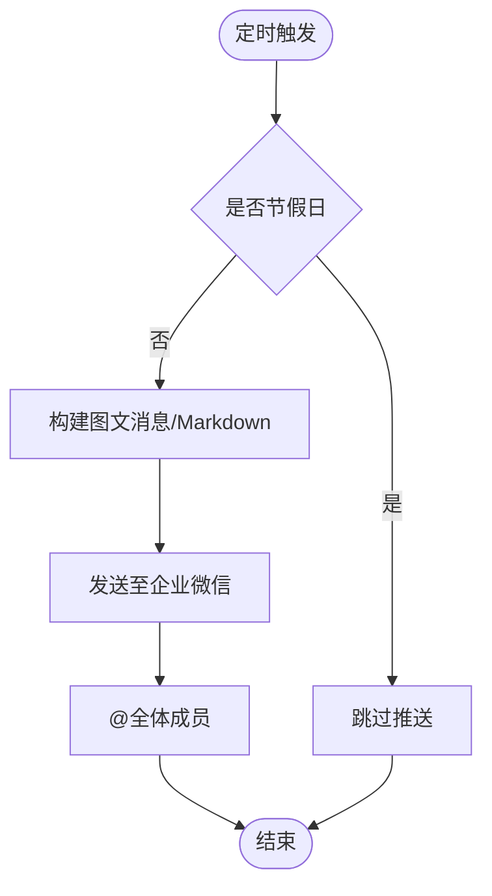
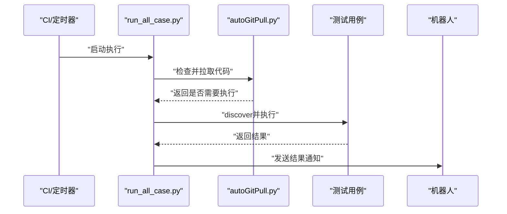
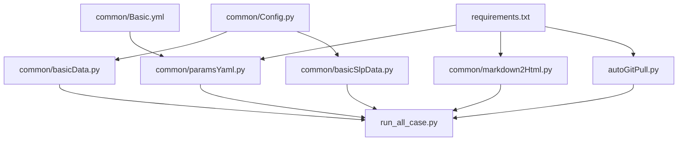

# 测试工具与脚本

<cite>
**本文引用的文件**
- [README.md](file://README.md)
- [requirements.txt](file://requirements.txt)
- [common/Config.py](file://common/Config.py)
- [common/Basic.yml](file://common/Basic.yml)
- [common/basicData.py](file://common/basicData.py)
- [common/basicSlpData.py](file://common/basicSlpData.py)
- [common/paramsYaml.py](file://common/paramsYaml.py)
- [common/markdown2Html.py](file://common/markdown2Html.py)
- [caseSlp/config.py](file://caseSlp/config.py)
- [caseSlp/tools.py](file://caseSlp/tools.py)
- [others/bot_dinner.py](file://others/bot_dinner.py)
- [others/bot_tea.py](file://others/bot_tea.py)
- [run_all_case.py](file://run_all_case.py)
- [autoGitPull.py](file://autoGitPull.py)
</cite>

## 目录
1. [简介](#简介)
2. [项目结构](#项目结构)
3. [核心组件](#核心组件)
4. [架构总览](#架构总览)
5. [详细组件分析](#详细组件分析)
6. [依赖分析](#依赖分析)
7. [性能考虑](#性能考虑)
8. [故障排查指南](#故障排查指南)
9. [结论](#结论)
10. [附录](#附录)

## 简介
本文件面向QA支付测试自动化项目的测试工具与辅助脚本，提供从数据准备、配置管理到报告转换与通知机器人等工具的使用说明与最佳实践。重点覆盖以下内容：
- 数据准备工具：basicData与basicSlpData的使用场景、参数说明与调用方式
- 配置管理工具：paramsYaml的读取机制与扩展方法
- 文档转换工具：markdown2Html的集成与自定义样式配置
- 辅助脚本：bot_dinner.py、bot_tea.py等的用途与使用示例
- 新工具开发与维护更新策略

## 项目结构
项目采用按功能域分层组织，核心模块位于common目录，各业务域（如国内、海外、SLP）分别有独立配置与工具集；others目录存放通知机器人等辅助脚本；run_all_case.py与autoGitPull.py负责测试执行与自动拉取更新。

**图表来源**
- [run_all_case.py:12-159](file://run_all_case.py#L12-L159)
- [autoGitPull.py:114-192](file://autoGitPull.py#L114-L192)
- [common/basicData.py:1-581](file://common/basicData.py#L1-L581)
- [common/basicSlpData.py:1-470](file://common/basicSlpData.py#L1-L470)
- [common/paramsYaml.py:8-32](file://common/paramsYaml.py#L8-L32)
- [common/markdown2Html.py:15-116](file://common/markdown2Html.py#L15-L116)
- [caseSlp/config.py:1-263](file://caseSlp/config.py#L1-L263)
- [caseSlp/tools.py:1-52](file://caseSlp/tools.py#L1-L52)
- [others/bot_dinner.py:18-51](file://others/bot_dinner.py#L18-L51)
- [others/bot_tea.py:18-58](file://others/bot_tea.py#L18-L58)

**章节来源**
- [README.md:1-38](file://README.md#L1-L38)
- [requirements.txt:1-85](file://requirements.txt#L1-L85)

## 核心组件
- 数据准备工具
  - basicData：封装国内支付场景的请求参数构造，支持多种消费类型（包房、聊天礼物、商店购买、守护等）
  - basicSlpData：封装SLP支付场景的请求参数构造，支持聊天礼物、包房、守护等
- 配置管理工具
  - paramsYaml：统一读取common/Basic.yml中的配置项，兼容不同主机平台编码差异
- 文档转换工具
  - markdown2Html：将Markdown转为HTML，内置多种扩展与样式资源，支持Mermaid流程图、数学公式等
- 辅助脚本
  - bot_dinner.py：企业微信机器人，定时推送晚餐点餐提醒
  - bot_tea.py：企业微信机器人，定时推送随机祝福语
- 运行与集成
  - run_all_case.py：统一入口，按应用选择用例目录、执行测试并发送结果通知
  - autoGitPull.py：自动拉取代码、校验分支、记录最新提交时间并通知

**章节来源**
- [common/basicData.py:8-325](file://common/basicData.py#L8-L325)
- [common/basicSlpData.py:6-456](file://common/basicSlpData.py#L6-L456)
- [common/paramsYaml.py:8-32](file://common/paramsYaml.py#L8-L32)
- [common/markdown2Html.py:15-116](file://common/markdown2Html.py#L15-L116)
- [others/bot_dinner.py:18-51](file://others/bot_dinner.py#L18-L51)
- [others/bot_tea.py:18-58](file://others/bot_tea.py#L18-L58)
- [run_all_case.py:12-159](file://run_all_case.py#L12-L159)
- [autoGitPull.py:114-192](file://autoGitPull.py#L114-L192)

## 架构总览
整体架构围绕“配置中心—数据准备—执行调度—通知反馈”的闭环展开。配置中心由Config与Basic.yml构成；数据准备通过basicData/basicSlpData生成标准化请求参数；paramsYaml提供统一配置读取；markdown2Html用于报告输出；run_all_case与autoGitPull实现自动化执行与更新通知。

**图表来源**
- [run_all_case.py:12-159](file://run_all_case.py#L12-L159)
- [autoGitPull.py:114-192](file://autoGitPull.py#L114-L192)
- [common/basicData.py:8-325](file://common/basicData.py#L8-L325)
- [common/basicSlpData.py:6-456](file://common/basicSlpData.py#L6-L456)
- [common/paramsYaml.py:8-32](file://common/paramsYaml.py#L8-L32)
- [common/markdown2Html.py:86-106](file://common/markdown2Html.py#L86-L106)

## 详细组件分析

### 数据准备工具：basicData 与 basicSlpData
- 功能概述
  - basicData：支持国内支付场景的多种消费类型，统一进行URL编码，便于直接拼接到请求中
  - basicSlpData：支持SLP支付场景，包含聊天礼物、包房、守护等类型，同样进行URL编码
- 使用场景
  - 国内支付：包房、多人包房、兑换、骑士守护、电台守护、聊天礼物、商店购买、守护升级/解除等
  - SLP支付：聊天礼物、包房、守护等
- 关键参数
  - payType：消费类型（如package、package-more、chat-gift、shop-buy、defend等）
  - money：金额
  - rid/uid/giftId/giftType/cid/boxType/num/package_cid/ctype/duction_money/star/defend_id/uids等
  - SLP版本：basicSlpData中默认version=2，useCoin=-1等
- 调用方式
  - 导入对应模块，调用encodeData函数，传入payType及相关参数，得到URL编码后的字符串
  - 可参考样例调用路径：[common/basicData.py:574-581](file://common/basicData.py#L574-L581)、[common/basicSlpData.py:460-470](file://common/basicSlpData.py#L460-L470)

**图表来源**
- [common/basicData.py:8-325](file://common/basicData.py#L8-L325)
- [common/basicSlpData.py:6-456](file://common/basicSlpData.py#L6-L456)

**章节来源**
- [common/basicData.py:8-325](file://common/basicData.py#L8-L325)
- [common/basicSlpData.py:6-456](file://common/basicSlpData.py#L6-L456)

### 配置管理工具：paramsYaml
- 功能概述
  - 统一读取common/Basic.yml中的配置项，支持不同主机平台的编码差异
- 使用方法
  - 实例化Yaml类，调用read_yaml方法，传入yaml文件名与配置项名称，返回对应值
  - 若文件不存在或配置项为空，返回相应错误类型
- 扩展机制
  - 可在Basic.yml中新增配置项，通过Yaml.read_yaml读取
  - 可在Yaml类中增加更多读取策略（如多环境切换、默认值回退等）

**图表来源**
- [common/paramsYaml.py:8-32](file://common/paramsYaml.py#L8-L32)
- [common/Config.py:6-8](file://common/Config.py#L6-L8)

**章节来源**
- [common/paramsYaml.py:8-32](file://common/paramsYaml.py#L8-L32)
- [common/Basic.yml:1-52](file://common/Basic.yml#L1-L52)

### 文档转换工具：markdown2Html
- 功能概述
  - 将Markdown文件转换为HTML，内置目录、任务列表、代码高亮、Mermaid流程图、KaTeX数学公式等扩展
- 集成方案
  - 在脚本中实例化mdtox，传入Markdown文件路径，调用to_html生成HTML文件
  - 可通过修改扩展与样式资源实现自定义主题
- 自定义样式配置
  - 扩展：toc、extra、mdx_math、markdown_checklist、pymdownx.*系列等
  - 样式：通过<link>引入外部CSS资源，或在模板中注入内联样式
  - Mermaid：启用custom_fences并指定class为mermaid，即可在代码块中渲染流程图

**图表来源**
- [common/markdown2Html.py:15-116](file://common/markdown2Html.py#L15-L116)

**章节来源**
- [common/markdown2Html.py:15-116](file://common/markdown2Html.py#L15-L116)

### 辅助脚本：bot_dinner.py 与 bot_tea.py
- bot_dinner.py
  - 功能：企业微信机器人，工作日定时推送晚餐点餐提醒，带封面图
  - 使用：直接运行脚本，或在计划任务中定时触发
  - 注意：节假日跳过推送
- bot_tea.py
  - 功能：企业微信机器人，定时推送随机祝福语，支持Markdown富文本
  - 使用：直接运行脚本，或在计划任务中定时触发
  - 注意：节假日跳过推送

**图表来源**
- [others/bot_dinner.py:18-51](file://others/bot_dinner.py#L18-L51)
- [others/bot_tea.py:18-58](file://others/bot_tea.py#L18-L58)

**章节来源**
- [others/bot_dinner.py:18-51](file://others/bot_dinner.py#L18-L51)
- [others/bot_tea.py:18-58](file://others/bot_tea.py#L18-L58)

### 运行与集成：run_all_case.py 与 autoGitPull.py
- run_all_case.py
  - 功能：按应用选择用例目录，自动发现并执行测试，统计失败/错误用例，发送通知
  - 支持应用：国内、海外、SLP
  - 通知：支持Slack与Markdown格式
- autoGitPull.py
  - 功能：自动拉取代码、校验分支、记录最新提交时间并通知
  - 支持应用：bb_php、bb_go、pt、slp_php、slp_common_rpc
  - 通知：支持Slack与Markdown格式

**图表来源**
- [run_all_case.py:12-159](file://run_all_case.py#L12-L159)
- [autoGitPull.py:114-192](file://autoGitPull.py#L114-L192)

**章节来源**
- [run_all_case.py:12-159](file://run_all_case.py#L12-L159)
- [autoGitPull.py:114-192](file://autoGitPull.py#L114-L192)

## 依赖分析
- 外部依赖
  - requests、PyYAML、GitPython、chinesecalendar、markdown及其扩展等
- 内部依赖
  - Config与Basic.yml为全局配置中心
  - basicData/basicSlpData依赖Config中的用户、房间、礼物等ID
  - paramsYaml依赖Config中的BASE_PATH定位yaml文件
  - markdown2Html依赖markdown扩展与外部CDN资源
  - run_all_case与autoGitPull共同依赖Robot通知模块（未在本仓库列出）

**图表来源**
- [requirements.txt:1-85](file://requirements.txt#L1-L85)
- [common/Config.py:6-8](file://common/Config.py#L6-L8)
- [common/Basic.yml:1-52](file://common/Basic.yml#L1-L52)
- [common/paramsYaml.py:8-32](file://common/paramsYaml.py#L8-L32)
- [common/basicData.py:1-5](file://common/basicData.py#L1-L5)
- [common/basicSlpData.py:1-2](file://common/basicSlpData.py#L1-L2)
- [common/markdown2Html.py:1-116](file://common/markdown2Html.py#L1-L116)
- [run_all_case.py:12-159](file://run_all_case.py#L12-L159)
- [autoGitPull.py:114-192](file://autoGitPull.py#L114-L192)

**章节来源**
- [requirements.txt:1-85](file://requirements.txt#L1-L85)

## 性能考虑
- 数据准备阶段
  - URL编码操作为O(n)复杂度，建议批量构造参数时避免重复编码
  - 对于多人包房场景，注意参数拼接与编码顺序，确保最终字符串正确
- 配置读取
  - paramsYaml读取yaml文件为IO操作，建议缓存常用配置项
- 文档转换
  - Markdown扩展较多时，转换耗时可能增加，建议在CI中异步处理或缓存中间产物
- 通知与网络
  - 机器人通知依赖网络，建议设置超时与重试策略，避免阻塞测试执行

## 故障排查指南
- 配置读取失败
  - 检查yaml文件是否存在与路径是否正确
  - 检查平台节点与编码设置，确保加载器一致
- 数据准备异常
  - 检查payType是否在支持列表中
  - 检查参数组合是否满足业务要求（如rid/uid/giftId等）
- 文档转换失败
  - 检查Markdown语法与扩展使用是否正确
  - 检查网络访问与CDN资源可用性
- 自动拉取失败
  - 检查分支是否匹配预期
  - 检查本地仓库状态与权限
- 通知失败
  - 检查机器人Webhook地址与权限
  - 检查节假日判断逻辑与触发条件

**章节来源**
- [common/paramsYaml.py:17-31](file://common/paramsYaml.py#L17-L31)
- [common/basicData.py:323-325](file://common/basicData.py#L323-L325)
- [common/markdown2Html.py:87-104](file://common/markdown2Html.py#L87-L104)
- [autoGitPull.py:164-167](file://autoGitPull.py#L164-L167)
- [others/bot_dinner.py:38-51](file://others/bot_dinner.py#L38-L51)
- [others/bot_tea.py:37-58](file://others/bot_tea.py#L37-L58)

## 结论
本项目通过统一的配置中心、标准化的数据准备工具、灵活的配置读取与文档转换能力，以及完善的自动化执行与通知机制，形成了完整的支付测试自动化工具链。建议在后续迭代中持续完善配置项与扩展机制，优化性能与稳定性，并加强跨域与多环境适配。

## 附录

### 开发新的测试工具与脚本
- 设计原则
  - 单一职责：每个工具聚焦一个明确目标
  - 可复用性：尽量抽象通用逻辑，减少重复代码
  - 可测试性：提供最小可运行示例与边界条件测试
- 推荐步骤
  - 明确需求与输入输出
  - 设计参数与异常处理
  - 编写单元测试与集成测试
  - 在run_all_case或autoGitPull中注册调用
  - 更新README与内部文档

### 维护与更新策略
- 版本管理
  - 使用requirements.txt统一管理依赖版本
  - 通过Git标签或分支控制发布节奏
- 配置演进
  - 在Basic.yml中新增配置项时，同步更新paramsYaml读取逻辑
  - 对于敏感信息，优先使用环境变量或密钥管理
- 自动化集成
  - 将工具纳入CI流水线，定期执行与告警
  - 对关键工具增加健康检查与回滚策略