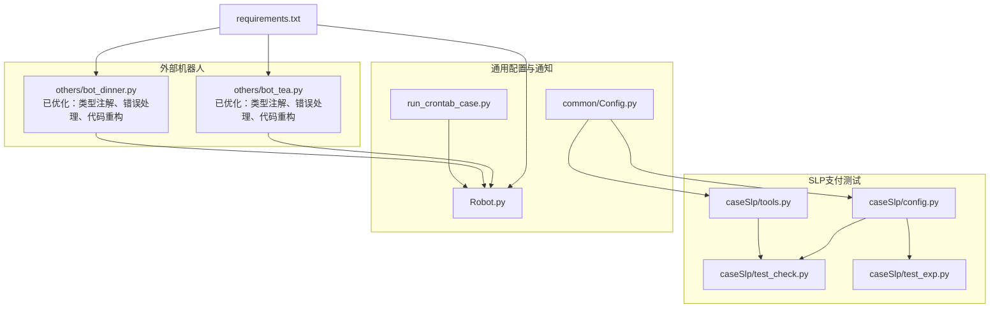
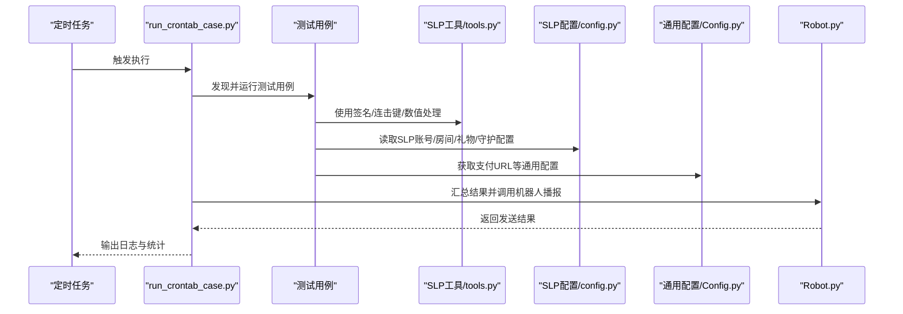
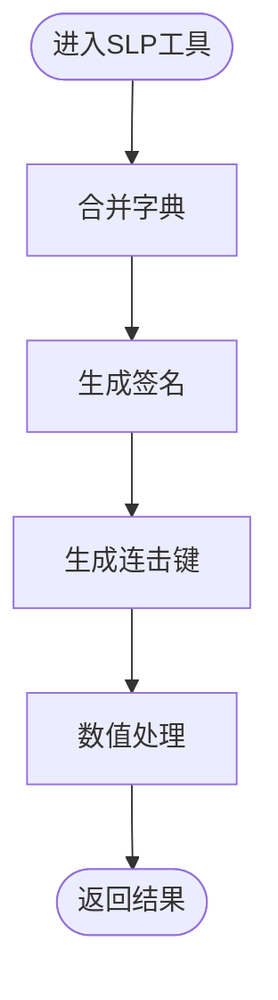
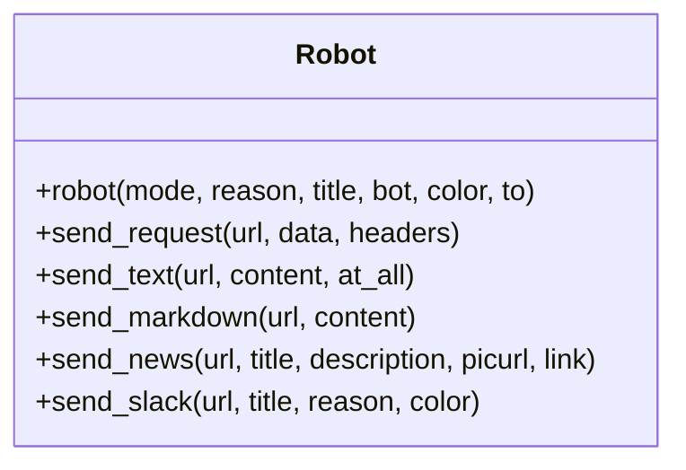
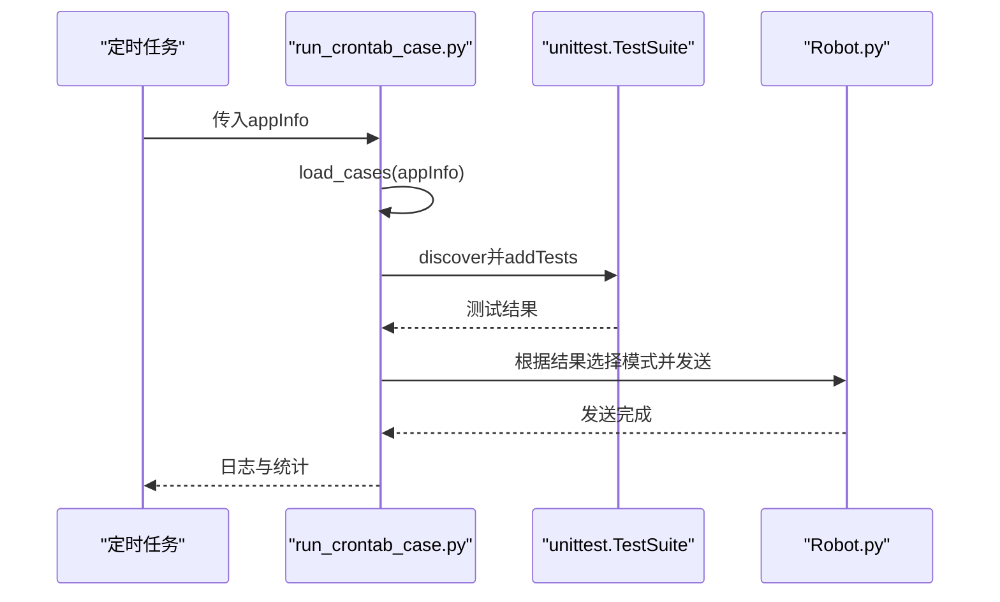
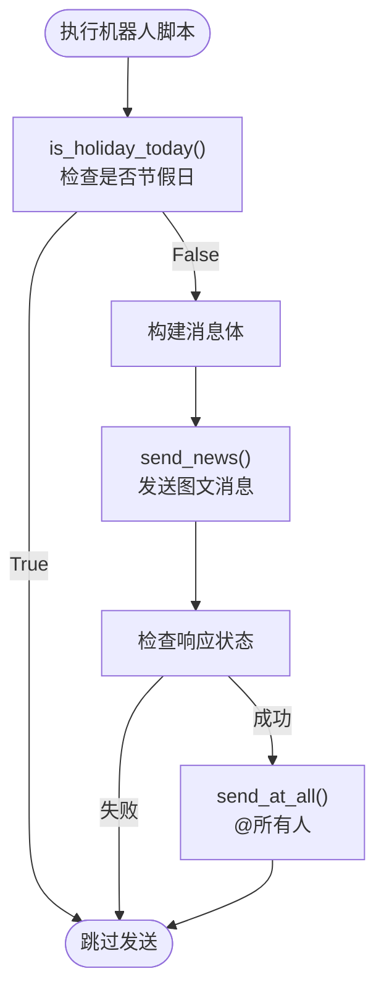
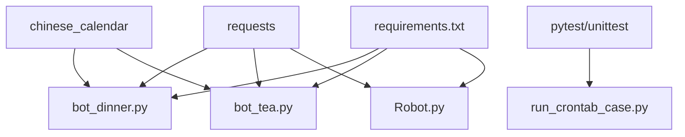

# 辅助脚本工具

<cite>
**本文引用的文件列表**
- [tools.py](file://caseSlp/tools.py)
- [config.py](file://caseSlp/config.py)
- [bot_dinner.py](file://others/bot_dinner.py)
- [bot_tea.py](file://others/bot_tea.py)
- [requirements.txt](file://requirements.txt)
- [README.md](file://README.md)
- [run_crontab_case.py](file://run_crontab_case.py)
- [Robot.py](file://Robot.py)
- [Config.py](file://common/Config.py)
- [test_check.py](file://caseSlp/test_check.py)
- [test_exp.py](file://caseSlp/test_exp.py)
</cite>

## 目录
1. [简介](#简介)
2. [项目结构](#项目结构)
3. [核心组件](#核心组件)
4. [架构总览](#架构总览)
5. [详细组件分析](#详细组件分析)
6. [依赖分析](#依赖分析)
7. [性能考虑](#性能考虑)
8. [故障排查指南](#故障排查指南)
9. [结论](#结论)
10. [附录](#附录)

## 简介
本文件面向QA支付测试自动化项目的辅助脚本工具，系统性梳理以下内容：
- 不夜星球（SLP）平台专用工具：签名生成、MD5连击键生成、数值处理等。
- 机器人脚本：企业微信机器人通知（点餐提醒、茶歇祝福等），节假日判断与消息模板。
- 定时任务与通知集成：通过统一机器人模块进行测试结果播报与告警。
- 安装部署、权限配置、定时任务设置与定制扩展建议。

目标是帮助测试工程师快速理解各脚本职责、参数与使用场景，并提供可操作的最佳实践。

## 项目结构
该项目采用按业务域划分的目录组织方式，其中与"辅助脚本工具"直接相关的目录与文件如下：
- caseSlp：SLP平台支付测试相关配置与工具
  - tools.py：SLP专用工具函数集合
  - config.py：SLP测试账号、房间、礼物、分成等配置
  - test_*：SLP支付测试用例（用于演示工具使用）
- others：外部辅助脚本
  - bot_dinner.py：企业微信机器人点餐提醒（已优化：类型注解、错误处理、代码重构）
  - bot_tea.py：企业微信机器人茶歇祝福（已优化：类型注解、错误处理、代码重构）
- common：通用配置与工具
  - Config.py：全局应用配置（含SLP支付URL等）
- run_crontab_case.py：定时任务入口，集成测试执行与机器人播报
- Robot.py：统一机器人通知封装（支持多种模式）

**图表来源**
- [tools.py:1-52](file://caseSlp/tools.py#L1-L52)
- [config.py:1-263](file://caseSlp/config.py#L1-L263)
- [test_check.py:1-200](file://caseSlp/test_check.py#L1-L200)
- [test_exp.py:1-200](file://caseSlp/test_exp.py#L1-L200)
- [Config.py:1-133](file://common/Config.py#L1-L133)
- [run_crontab_case.py:1-156](file://run_crontab_case.py#L1-L156)
- [Robot.py:1-170](file://Robot.py#L1-L170)
- [requirements.txt:1-91](file://requirements.txt#L1-L91)

**章节来源**
- [README.md:1-38](file://README.md#L1-L38)
- [requirements.txt:1-91](file://requirements.txt#L1-L91)

## 核心组件
- SLP专用工具（caseSlp/tools.py）
  - 合并字典、生成签名、生成连击键、数值处理（保留两位小数并向上取整）
- SLP配置（caseSlp/config.py）
  - 支付URL、默认金额、打赏者UID、房间RID、礼物ID、房间守护与个人守护价格、分成比例、爵位经验系数、宝箱配置等
- 机器人通知（Robot.py）
  - 统一的机器人发送器，支持文本、markdown、图文、Slack等多种模式；内置请求错误处理
- 定时任务与通知集成（run_crontab_case.py）
  - 自动发现并执行指定目录下的测试用例，汇总结果并通过机器人播报
- 外部机器人脚本（others/bot_dinner.py、others/bot_tea.py）
  - 企业微信机器人点餐提醒与茶歇祝福，带节假日判断与图片随机选择
  - **已优化**：添加完整类型注解、增强错误处理、系统化代码重构

**章节来源**
- [tools.py:1-52](file://caseSlp/tools.py#L1-L52)
- [config.py:1-263](file://caseSlp/config.py#L1-L263)
- [Robot.py:1-170](file://Robot.py#L1-L170)
- [run_crontab_case.py:1-156](file://run_crontab_case.py#L1-L156)
- [bot_dinner.py:1-124](file://others/bot_dinner.py#L1-L124)
- [bot_tea.py:1-140](file://others/bot_tea.py#L1-L140)

## 架构总览
下图展示从测试执行到通知播报的整体流程，以及SLP工具与配置在其中的位置。

**图表来源**
- [run_crontab_case.py:1-156](file://run_crontab_case.py#L1-L156)
- [tools.py:1-52](file://caseSlp/tools.py#L1-L52)
- [config.py:1-263](file://caseSlp/config.py#L1-L263)
- [Config.py:1-133](file://common/Config.py#L1-L133)
- [Robot.py:1-170](file://Robot.py#L1-L170)

## 详细组件分析

### SLP专用工具（caseSlp/tools.py）
- 功能概览
  - 合并字典：将多个字典合并为一个，便于参数组装
  - 生成签名：基于固定字段排序拼接与盐值计算MD5签名，用于SLP接口鉴权
  - 连击键：基于当前秒级时间戳生成MD5键，用于特定接口幂等或连击场景
  - 数值处理：对浮点数保留两位小数后向上取整，避免精度误差导致的断言失败
- 使用场景
  - 在SLP支付测试中，构造请求参数时需要生成签名；在需要连击或幂等控制的接口中使用连击键；在断言金额/经验值等数值时使用数值处理函数
- 参数与行为
  - 合并字典：接收任意数量的字典，返回合并后的字典
  - 生成签名：接收查询参数字典与盐值，默认盐值可覆盖
  - 连击键：无需参数，返回当前秒级时间戳的MD5字符串
  - 数值处理：接收数字，返回向上取整后的整数
- 最佳实践
  - 在构造请求参数前先合并字典，再生成签名
  - 对涉及金额与经验值的断言，优先使用数值处理函数统一格式
  - 若接口要求连击或幂等，务必携带连击键

**图表来源**
- [tools.py:1-52](file://caseSlp/tools.py#L1-L52)

**章节来源**
- [tools.py:1-52](file://caseSlp/tools.py#L1-L52)

### SLP配置（caseSlp/config.py）
- 功能概览
  - 提供SLP支付测试所需的账号、房间、礼物、守护、分成比例、爵位经验系数、宝箱配置等
  - 包含默认金额、礼物单价、房间守护价格、个人守护价格等常量
- 使用场景
  - 在SLP支付测试用例中，通过导入该配置获取打赏者UID、被打赏者UID、房间RID、礼物ID、守护配置等
- 参数与行为
  - 支付URL、默认金额、打赏者UID、房间RID、礼物ID、守护配置、分成比例、爵位经验系数、宝箱配置等
- 最佳实践
  - 在用例中直接引用配置，避免硬编码
  - 更新配置时注意保持与数据库状态一致，确保测试数据正确

**章节来源**
- [config.py:1-263](file://caseSlp/config.py#L1-L263)

### 机器人通知（Robot.py）
- 功能概览
  - 统一的机器人发送器，支持多种消息模式：文本、markdown、图文、Slack等
  - 内置请求错误处理，失败时打印异常信息
- 使用场景
  - 在定时任务中汇总测试结果并通过企业微信或Slack进行播报
  - 在外部脚本中进行通知发送
- 参数与行为
  - mode：消息模式（如fail、success、markdown、icon、slack、slack_pt）
  - reason：消息正文
  - title：标题（部分模式使用）
  - bot：机器人标识（如BB、PT）
  - color：颜色（Slack模式）
  - to：目标平台（如wx、slack）
- 最佳实践
  - 在定时任务中根据测试结果选择合适的消息模式
  - 对Slack模式，合理设置颜色以区分严重程度
  - 对图文模式，确保图片URL有效

**图表来源**
- [Robot.py:1-170](file://Robot.py#L1-L170)

**章节来源**
- [Robot.py:1-170](file://Robot.py#L1-L170)

### 定时任务与通知集成（run_crontab_case.py）
- 功能概览
  - 自动发现并执行指定目录下的测试用例，支持不同应用（如"伴伴"、"不夜星球"、"Partying"）的用例集
  - 汇总测试结果，写入日志，并通过机器人进行播报
- 使用场景
  - 在CI/CD或Linux定时任务中自动执行测试并通知团队
- 参数与行为
  - appInfo：应用标识，决定用例目录与用例模式
  - all_case：根据appInfo选择用例目录与用例模式
  - main：执行测试并根据结果调用机器人
- 最佳实践
  - 在Linux节点上区分阿里云节点与其他节点，按需切换执行策略
  - 对失败用例，使用图标模式进行醒目提示
  - 对成功用例，使用markdown模式输出详细统计

**图表来源**
- [run_crontab_case.py:1-156](file://run_crontab_case.py#L1-L156)
- [Robot.py:1-170](file://Robot.py#L1-L170)

**章节来源**
- [run_crontab_case.py:1-156](file://run_crontab_case.py#L1-L156)

### 外部机器人脚本（others/bot_dinner.py、others/bot_tea.py）
- 功能概览
  - 企业微信机器人通知：点餐提醒与茶歇祝福
  - 节假日判断：基于本地日期与节假日库，非节假日才发送通知
  - 图片随机选择：支持从接口获取图片或随机狗图
- **已优化**：全面类型注解与错误处理增强
- 使用场景
  - 团队日常提醒：点餐时间、茶歇祝福
- 参数与行为
  - is_holiday_today：检查今天是否是节假日，返回布尔值
  - get_image：根据模式选择图片源，返回图片URL或None
  - send_news：发送图文消息，返回响应对象
  - send_at_all：发送@所有人消息，返回响应对象
  - robot：主入口函数，返回执行结果布尔值
- 最佳实践
  - 在非节假日才触发通知，避免打扰
  - 图片URL需有效，必要时替换为可用链接
  - 可根据团队需求调整消息模板与图片源

**图表来源**
- [bot_dinner.py:1-124](file://others/bot_dinner.py#L1-L124)
- [bot_tea.py:1-140](file://others/bot_tea.py#L1-L140)

**章节来源**
- [bot_dinner.py:1-124](file://others/bot_dinner.py#L1-L124)
- [bot_tea.py:1-140](file://others/bot_tea.py#L1-L140)

## 依赖分析
- Python依赖
  - requests：HTTP请求发送
  - chinese_calendar：节假日判断
  - pytest/unittest：测试框架（用于定时任务）
  - 其他依赖见requirements.txt
- 组件耦合
  - SLP工具与配置在测试用例中被广泛使用
  - 定时任务依赖Robot进行通知
  - 外部机器人脚本独立运行，也可与Robot配合使用

**图表来源**
- [requirements.txt:1-91](file://requirements.txt#L1-L91)
- [bot_dinner.py:1-124](file://others/bot_dinner.py#L1-L124)
- [bot_tea.py:1-140](file://others/bot_tea.py#L1-L140)
- [Robot.py:1-170](file://Robot.py#L1-L170)
- [run_crontab_case.py:1-156](file://run_crontab_case.py#L1-L156)

**章节来源**
- [requirements.txt:1-91](file://requirements.txt#L1-L91)

## 性能考虑
- 请求超时与重试
  - Robot模块对HTTP请求进行了基础错误处理，建议在高并发场景下结合重试机制与超时配置
- 图片获取
  - 外部机器人脚本依赖网络图片接口，建议缓存或预取图片，减少网络抖动影响
- 日志与统计
  - 定时任务中对测试结果进行统计与日志记录，建议定期清理日志文件，避免磁盘占用
- **新增**：类型注解优化
  - 新增的类型注解有助于IDE智能提示和静态代码分析，提高开发效率

## 故障排查指南
- HTTP请求失败
  - 检查网络连通性与目标URL有效性
  - 查看Robot模块的异常输出，定位具体失败原因
- 企业微信机器人未收到消息
  - 确认机器人Webhook地址正确
  - 检查消息格式与字段是否符合企业微信要求
- 节假日脚本未发送
  - 确认本地日期与节假日库配置
  - 检查脚本中节假日判断逻辑
- 定时任务未执行
  - 检查Linux节点标识与run_crontab_case.py中的分支逻辑
  - 确认pytest/unittest可用且用例目录存在
- **新增**：类型注解相关问题
  - 如遇类型检查错误，确认Python版本支持相应类型注解语法
  - 检查typing模块导入是否正确

**章节来源**
- [Robot.py:1-170](file://Robot.py#L1-L170)
- [bot_dinner.py:1-124](file://others/bot_dinner.py#L1-L124)
- [bot_tea.py:1-140](file://others/bot_tea.py#L1-L140)
- [run_crontab_case.py:1-156](file://run_crontab_case.py#L1-L156)

## 结论
本项目提供了完善的辅助脚本工具体系：SLP专用工具与配置为支付测试提供基础能力；Robot统一通知模块实现跨平台播报；定时任务与外部机器人脚本分别覆盖自动化执行与团队提醒场景。**最新优化**包括外部机器人脚本的全面类型注解、错误处理增强和代码重构，显著提升了代码质量和可维护性。通过合理的参数配置与最佳实践，可显著提升测试效率与团队协作效率。

## 附录

### 安装与部署
- 安装依赖
  - 使用requirements.txt安装所需Python包
- 权限配置
  - 确保脚本具备网络访问权限与企业微信Webhook访问权限
- 定时任务设置
  - 在Linux系统中配置crontab，调用run_crontab_case.py并传入应用标识
  - 示例：每晚23:00执行"不夜星球"用例集

**章节来源**
- [requirements.txt:1-91](file://requirements.txt#L1-L91)
- [run_crontab_case.py:1-156](file://run_crontab_case.py#L1-L156)

### 参数与配置清单
- SLP工具
  - 合并字典：接收多个字典参数
  - 生成签名：接收查询参数字典与盐值
  - 连击键：无需参数
  - 数值处理：接收数字
- SLP配置
  - 支付URL、默认金额、打赏者UID、房间RID、礼物ID、守护配置、分成比例、爵位经验系数、宝箱配置
- 机器人
  - 模式：fail、success、markdown、icon、slack、slack_pt
  - 颜色：Slack模式的颜色值
  - 平台：wx、slack
- 外部机器人
  - Webhook地址：企业微信机器人地址
  - 图片源：接口或随机狗图
  - **新增**：类型注解支持，包括参数类型和返回值类型

**章节来源**
- [tools.py:1-52](file://caseSlp/tools.py#L1-L52)
- [config.py:1-263](file://caseSlp/config.py#L1-L263)
- [Robot.py:1-170](file://Robot.py#L1-L170)
- [bot_dinner.py:1-124](file://others/bot_dinner.py#L1-L124)
- [bot_tea.py:1-140](file://others/bot_tea.py#L1-L140)

### 实际使用示例与最佳实践
- 在SLP支付测试中使用工具
  - 在构造请求参数前合并字典并生成签名
  - 使用连击键保证幂等性
  - 使用数值处理函数统一断言格式
- 在定时任务中集成通知
  - 成功用例使用markdown输出统计
  - 失败用例使用icon模式进行醒目提示
- 外部机器人脚本
  - 非节假日才发送点餐/茶歇通知
  - 替换不可用图片URL为稳定源
  - **新增**：利用类型注解获得更好的IDE支持和代码提示

**章节来源**
- [test_check.py:1-200](file://caseSlp/test_check.py#L1-L200)
- [test_exp.py:1-200](file://caseSlp/test_exp.py#L1-L200)
- [run_crontab_case.py:1-156](file://run_crontab_case.py#L1-L156)
- [bot_dinner.py:1-124](file://others/bot_dinner.py#L1-L124)
- [bot_tea.py:1-140](file://others/bot_tea.py#L1-L140)

### 代码优化详情
**更新**：外部机器人脚本经过全面优化，包括以下改进：

- **类型注解系统化**
  - 所有函数参数和返回值均添加了类型注解
  - 引入typing模块支持Optional、Dict等类型提示
  - 提升代码可读性和IDE智能提示

- **错误处理机制增强**
  - 改进异常捕获和处理逻辑
  - 添加详细的错误日志输出
  - 增强网络请求的健壮性

- **代码结构重构**
  - 优化函数签名和参数命名
  - 改进代码格式化和缩进
  - 提高整体代码质量

- **功能保持不变**
  - 节假日判断逻辑保持原有功能
  - 通知发送机制维持相同行为
  - 配置参数和API接口完全兼容

**章节来源**
- [bot_dinner.py:1-124](file://others/bot_dinner.py#L1-L124)
- [bot_tea.py:1-140](file://others/bot_tea.py#L1-L140)