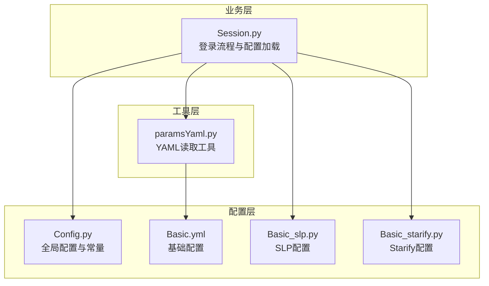
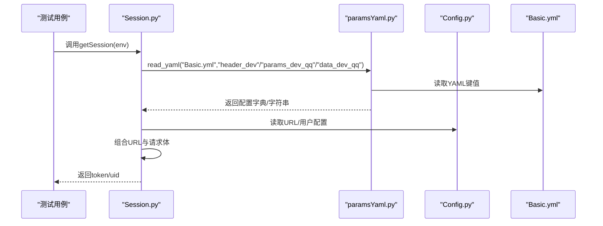
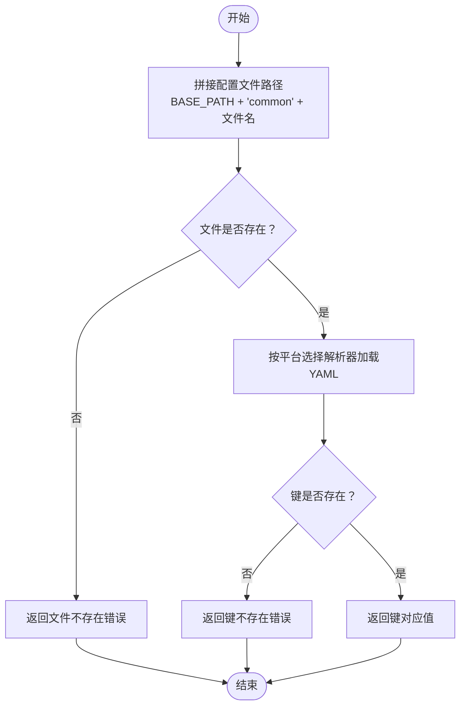
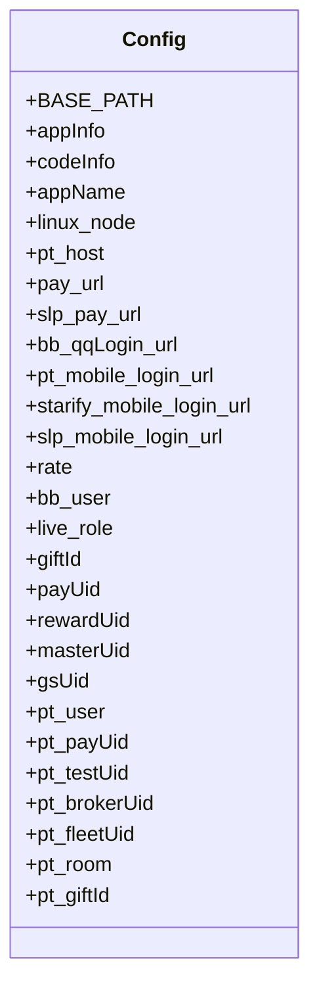
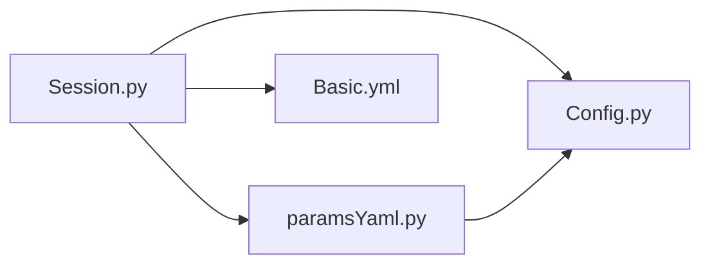

# 配置管理工具

<cite>
**本文引用的文件**
- [paramsYaml.py](file://common/paramsYaml.py)
- [Config.py](file://common/Config.py)
- [Basic.yml](file://common/Basic.yml)
- [Session.py](file://common/Session.py)
- [Basic_slp.py](file://common/Basic_slp.py)
- [Basic_starify.py](file://common/Basic_starify.py)
- [README.md](file://README.md)
</cite>

## 目录
1. [简介](#简介)
2. [项目结构](#项目结构)
3. [核心组件](#核心组件)
4. [架构总览](#架构总览)
5. [详细组件分析](#详细组件分析)
6. [依赖分析](#依赖分析)
7. [性能考虑](#性能考虑)
8. [故障排查指南](#故障排查指南)
9. [结论](#结论)
10. [附录](#附录)

## 简介
本文件面向QA支付测试自动化项目，系统化介绍“paramsYaml配置管理工具”的功能与使用方法，重点覆盖：
- 如何通过YAML文件统一管理测试配置参数
- Config.py中的配置加载机制与参数优先级规则
- Basic.yml配置文件的结构说明与参数配置示例
- 环境配置、用户配置、房间配置、礼物配置等各类配置项的使用方法
- 动态加载配置、配置参数的验证机制，以及配置文件的扩展与自定义方法

## 项目结构
配置管理工具主要由以下模块组成：
- paramsYaml.py：提供YAML文件读取能力，支持按环境选择解析器
- Config.py：集中管理应用信息、服务器节点、URL、用户与房间、礼物等全局配置
- Basic.yml：存放各环境的HTTP头、登录参数、设备参数等基础配置
- Session.py：在登录流程中动态加载Basic.yml中的配置，完成登录与回话获取
- Basic_slp.py、Basic_starify.py：特定业务线的额外配置（如SLP、Starify）

图表来源
- [paramsYaml.py:1-32](file://common/paramsYaml.py#L1-L32)
- [Config.py:1-133](file://common/Config.py#L1-L133)
- [Basic.yml:1-52](file://common/Basic.yml#L1-L52)
- [Session.py:1-200](file://common/Session.py#L1-L200)
- [Basic_slp.py:1-34](file://common/Basic_slp.py#L1-L34)
- [Basic_starify.py:1-36](file://common/Basic_starify.py#L1-L36)

章节来源
- [README.md:1-38](file://README.md#L1-L38)

## 核心组件
- paramsYaml工具类
  - 提供静态方法读取指定YAML文件中的键值
  - 自动拼接BASE_PATH与common目录，定位配置文件
  - 根据运行主机节点选择不同的YAML解析器，兼容不同平台
  - 对不存在的文件或键返回特定错误类型，便于上层捕获处理
- Config类
  - 统一维护应用信息、代码路径、服务器节点标识
  - 定义测试域名、支付接口URL、登录接口URL等
  - 提供用户配置（支付者、被支付者、公会/家族用户）、角色配置、礼物配置等
  - 提供PT、SLP等业务线的用户、房间、礼物等配置字典
- Basic.yml
  - 存放各环境的HTTP头、登录参数、设备参数等
  - 包含dev、pt、slp等环境的基础配置键
- Session.py
  - 在登录流程中按环境动态读取Basic.yml中的配置
  - 将读取到的配置与Config.py中的URL组合，发起登录请求
  - 支持多环境登录回退策略与日志记录

章节来源
- [paramsYaml.py:8-32](file://common/paramsYaml.py#L8-L32)
- [Config.py:6-133](file://common/Config.py#L6-L133)
- [Basic.yml:1-52](file://common/Basic.yml#L1-L52)
- [Session.py:13-200](file://common/Session.py#L13-L200)

## 架构总览
配置管理工具采用“配置文件 + 工具类 + 业务调用”的分层设计：
- 配置文件层：Basic.yml存放基础配置；Config.py存放全局常量与业务配置
- 工具类层：paramsYaml负责YAML读取与平台适配
- 业务调用层：Session.py在登录流程中按需读取配置并发起请求

图表来源
- [Session.py:20-102](file://common/Session.py#L20-L102)
- [paramsYaml.py:10-29](file://common/paramsYaml.py#L10-L29)
- [Config.py:47-106](file://common/Config.py#L47-L106)
- [Basic.yml:2-52](file://common/Basic.yml#L2-L52)

## 详细组件分析

### paramsYaml配置读取工具
- 功能要点
  - 动态拼接配置文件路径：基于Config.BASE_PATH与common目录定位YAML文件
  - 平台适配：根据运行主机节点选择不同的YAML解析器，避免不同平台的警告或解析差异
  - 错误处理：当文件不存在或键值为None时，返回特定错误类型，便于上层统一捕获
- 使用建议
  - 确保传入的YAML文件名与键名正确
  - 在调用前确认目标环境对应的YAML键存在
  - 对返回值进行类型检查与空值判断

图表来源
- [paramsYaml.py:10-31](file://common/paramsYaml.py#L10-L31)

章节来源
- [paramsYaml.py:8-32](file://common/paramsYaml.py#L8-L32)

### Config.py配置加载机制与参数优先级
- 加载机制
  - BASE_PATH自动推导工程根目录，用于后续路径拼接
  - appInfo、codeInfo、appName等字典集中管理应用与代码路径信息
  - linux_node用于识别运行主机节点，配合paramsYaml实现平台适配
  - URL常量（如支付接口、登录接口）直接基于appInfo拼接
  - 用户配置、房间配置、礼物配置等以字典形式提供，便于按需读取
- 参数优先级规则
  - 运行时优先：Session.py在登录时按env动态选择配置键，覆盖默认值
  - 文件优先：Basic.yml中的键值优先于硬编码默认值
  - 平台优先：paramsYaml根据linux_node选择解析器，确保跨平台一致性
  - 字典优先：Config.py中的字典键值优先于分散的变量，便于统一管理

图表来源
- [Config.py:6-133](file://common/Config.py#L6-L133)

章节来源
- [Config.py:6-133](file://common/Config.py#L6-L133)

### Basic.yml配置文件结构与参数示例
- 结构说明
  - 分组键：header_dev、header_pt、header_slp等，分别对应不同环境的HTTP头
  - 登录参数：data_pt_mobile、data_slp_mobile等，包含手机号、区域码、验证码等
  - 设备参数：data_pt_mobile_params、data_slp_mobile_params等，包含包名、平台、签名等
  - 其他参数：params_dev_qq、params_teammate_qq等，用于特定登录场景
- 参数配置示例
  - header_dev：包含Content-Type、User-Agent、host等
  - data_dev_qq：包含type、dtoken等登录凭据
  - data_pt_mobile_params：包含包名、平台、时间戳、签名等
  - data_slp_mobile：包含mobile、type、code、token、dtoken、area等
- 使用方法
  - 在Session.py中按环境读取对应键值，组合URL与请求体
  - 对于需要签名的场景，可在业务层自行计算并注入

章节来源
- [Basic.yml:1-52](file://common/Basic.yml#L1-L52)
- [Session.py:26-162](file://common/Session.py#L26-L162)

### 环境配置、用户配置、房间配置、礼物配置
- 环境配置
  - appInfo：维护各应用的测试域名
  - linux_node：维护不同服务器节点标识，用于平台适配
  - URL常量：基于appInfo拼接支付与登录接口URL
- 用户配置
  - bb_user：包含支付者、被支付者、公会/家族用户等UID
  - pt_user：包含PT业务线的支付者、测试者、经纪人、家族UID
  - live_role：包含直播场景的角色UID与房间ID
- 房间配置
  - pt_room：包含PT业务线的房间类型与房间ID
- 礼物配置
  - giftId：包含基础礼物ID映射
  - pt_giftId：包含PT业务线的礼物ID映射

章节来源
- [Config.py:59-129](file://common/Config.py#L59-L129)

### 动态加载配置与验证机制
- 动态加载
  - Session.py在登录时按env选择配置键，调用paramsYaml.read_yaml读取Basic.yml
  - Config.py中的URL与用户配置在运行时直接读取，无需额外加载
- 验证机制
  - paramsYaml对文件存在性与键存在性进行检查，返回特定错误类型
  - Session.py对响应结果进行校验，若失败则触发备用登录方案
  - 日志记录：对异常进行统一记录，便于问题定位

章节来源
- [paramsYaml.py:17-29](file://common/paramsYaml.py#L17-L29)
- [Session.py:54-67](file://common/Session.py#L54-L67)
- [Session.py:98-104](file://common/Session.py#L98-L104)

### 配置文件扩展与自定义方法
- 扩展Basic.yml
  - 新增环境键：如header_new_env、data_new_env_params等
  - 新增业务线配置：如Basic_slp.py、Basic_starify.py的风格
- 自定义Config.py
  - 新增业务线配置字典：如pt_room、pt_giftId等
  - 新增URL常量：基于appInfo拼接新的接口URL
- 自定义paramsYaml
  - 可增加更多平台适配逻辑，或扩展错误处理策略
  - 可增加缓存机制，减少重复读取开销

章节来源
- [Basic.yml:1-52](file://common/Basic.yml#L1-L52)
- [Config.py:59-129](file://common/Config.py#L59-L129)
- [paramsYaml.py:10-29](file://common/paramsYaml.py#L10-L29)

## 依赖分析
- 组件耦合
  - Session.py依赖paramsYaml与Config，体现“业务调用工具+配置”的分层
  - paramsYaml依赖Config.BASE_PATH与Config.linux_node，体现“平台适配”与“路径拼接”
  - Basic.yml被Session.py直接读取，形成“配置即代码”的直观模式
- 外部依赖
  - YAML解析依赖Python标准库yaml模块
  - 请求发送依赖requests库
  - 日志记录依赖自定义Logs模块

图表来源
- [Session.py:9-10](file://common/Session.py#L9-L10)
- [paramsYaml.py:2-3](file://common/paramsYaml.py#L2-L3)
- [Config.py:2-3](file://common/Config.py#L2-L3)

章节来源
- [Session.py:9-10](file://common/Session.py#L9-L10)
- [paramsYaml.py:2-3](file://common/paramsYaml.py#L2-L3)
- [Config.py:2-3](file://common/Config.py#L2-L3)

## 性能考虑
- YAML读取优化
  - 当前实现每次读取都会打开并解析文件，建议在高频场景下引入缓存机制，减少重复IO
- 平台适配
  - 解析器选择逻辑简单明确，建议保持现状，避免过度复杂化
- 请求与日志
  - Session.py中对异常的处理与日志记录较为完善，建议保持现有策略

## 故障排查指南
- 文件不存在
  - 症状：返回文件不存在错误
  - 排查：确认YAML文件名与路径是否正确，确认文件存在于common目录
- 键不存在
  - 症状：返回键不存在错误
  - 排查：确认Basic.yml中是否存在该键，确认键名大小写与拼写
- 平台解析异常
  - 症状：不同平台解析结果不一致
  - 排查：确认Config.linux_node中的节点标识与实际主机一致
- 登录失败
  - 症状：响应中success不为1或token缺失
  - 排查：检查Basic.yml中的登录参数是否正确，确认Config.py中的URL拼接是否正确

章节来源
- [paramsYaml.py:17-29](file://common/paramsYaml.py#L17-L29)
- [Session.py:54-67](file://common/Session.py#L54-L67)
- [Session.py:98-104](file://common/Session.py#L98-L104)

## 结论
本配置管理工具通过“YAML文件 + 工具类 + 业务调用”的分层设计，实现了测试配置的集中管理与动态加载。Config.py提供全局常量与业务配置，Basic.yml提供基础配置，paramsYaml负责跨平台适配与错误处理，Session.py在登录流程中按环境动态读取并组合配置。该体系具备良好的扩展性与可维护性，适合在多环境、多业务线的测试场景中推广使用。

## 附录
- 常用键参考
  - header_dev/header_pt/header_slp：HTTP头配置
  - data_dev_qq/data_pt_mobile/data_slp_mobile：登录凭据
  - data_pt_mobile_params/data_slp_mobile_params：设备与签名参数
  - params_dev_qq/params_teammate_qq：其他参数
- 业务线配置参考
  - bb_user、pt_user、live_role：用户与角色配置
  - pt_room、pt_giftId：房间与礼物配置
- 使用建议
  - 在新增环境或业务线时，优先扩展Basic.yml与Config.py，保持配置集中管理
  - 对高频读取的配置可考虑引入缓存，提升性能