# 自动化与CI/CD

<cite>
**本文引用的文件**
- [README.md](file://README.md)
- [requirements.txt](file://requirements.txt)
- [run_all_case.py](file://run_all_case.py)
- [run_crontab_case.py](file://run_crontab_case.py)
- [autoGitPull.py](file://autoGitPull.py)
- [common/Config.py](file://common/Config.py)
- [common/HTMLTestRunner.py](file://common/HTMLTestRunner.py)
- [common/runFailed.py](file://common/runFailed.py)
- [common/Consts.py](file://common/Consts.py)
- [common/Logs.py](file://common/Logs.py)
- [Robot.py](file://Robot.py)
- [common/Session.py](file://common/Session.py)
- [common/Basic.yml](file://common/Basic.yml)
- [case/test_pay_business.py](file://case/test_pay_business.py)
</cite>

## 更新摘要
**变更内容**
- 更新Git代码更新器模块：autoGitPull.py从简单脚本演进为强大的GitUpdater类
- 新增面向对象设计、配置管理和错误处理机制
- 引入集中式应用程序配置管理
- 增强错误日志记录和分支验证机制
- 新增Session类用于会话管理
- 更新通知系统配置和管理

## 目录
1. [简介](#简介)
2. [项目结构](#项目结构)
3. [核心组件](#核心组件)
4. [架构总览](#架构总览)
5. [详细组件分析](#详细组件分析)
6. [依赖分析](#依赖分析)
7. [性能考虑](#性能考虑)
8. [故障排除指南](#故障排除指南)
9. [结论](#结论)
10. [附录](#附录)

## 简介
本文件面向QA支付测试自动化项目的自动化与持续集成（CI/CD）落地，系统性阐述测试调度、执行监控、结果收集、Git代码更新检测、定时任务配置、测试触发策略、HTML测试报告生成、失败重试机制以及通知系统配置与使用。同时提供Jenkins、GitLab CI等主流平台的集成方案要点与最佳实践，帮助团队建立稳定高效的自动化测试流水线。

**更新** 项目现已采用现代化的面向对象设计，Git代码更新器模块经过重构，提供了更强大和可靠的代码更新检测与通知功能。

## 项目结构
项目采用按业务域分层的组织方式：
- 测试用例按模块划分：case、caseOversea、caseGames、caseSlp、caseStarify 等目录，便于按应用或区域维度执行。
- 公共能力集中在 common 目录：配置、请求封装、断言、日志、数据库连接、HTML报告、失败重试、常量等。
- 根目录脚本负责调度与触发：run_all_case.py、run_crontab_case.py、autoGitPull.py、Robot.py 等。

```mermaid
graph TB
subgraph "测试用例"
CASE["case/*"]
CASEO["caseOversea/*"]
CASEG["caseGames/*"]
CASESLP["caseSlp/*"]
CASESTAR["caseStarify/*"]
END
subgraph "公共能力"
CONF["common/Config.py"]
REQ["common/Request.py"]
ASSERT["common/Assert.py"]
LOGS["common/Logs.py"]
HTML["common/HTMLTestRunner.py"]
RETRY["common/runFailed.py"]
CONSTS["common/Consts.py"]
SESSION["common/Session.py"]
BASIC["common/Basic.yml"]
END
subgraph "调度与触发"
RUNALL["run_all_case.py"]
RUNCRT["run_crontab_case.py"]
GITUPDATER["autoGitPull.py<br/>GitUpdater类"]
ROBOT["Robot.py"]
END
CASE --> RUNALL
CASEO --> RUNALL
CASEG --> RUNALL
CASESLP --> RUNALL
CASESTAR --> RUNALL
RUNALL --> HTML
RUNALL --> ROBOT
RUNALL --> LOGS
RUNALL --> CONF
RUNALL --> SESSION
RUNCRT --> HTML
RUNCRT --> ROBOT
RUNCRT --> LOGS
RUNCRT --> CONF
GITUPDATER --> ROBOT
GITUPDATER --> LOGS
GITUPDATER --> CONF
GITUPDATER --> SESSION
```

**图示来源**
- [run_all_case.py:12-159](file://run_all_case.py#L12-L159)
- [run_crontab_case.py:9-79](file://run_crontab_case.py#L9-L79)
- [autoGitPull.py:56-192](file://autoGitPull.py#L56-L192)
- [common/HTMLTestRunner.py:516-705](file://common/HTMLTestRunner.py#L516-L705)
- [common/Config.py:6-133](file://common/Config.py#L6-L133)
- [common/Session.py:13-200](file://common/Session.py#L13-L200)

**章节来源**
- [README.md:1-38](file://README.md#L1-L38)
- [requirements.txt:1-85](file://requirements.txt#L1-L85)

## 核心组件
- **现代化Git代码更新器**：GitUpdater类提供基于Git仓库的分支校验、提交时间戳比较与机器人通知能力，支持多应用分支与环境配置，具备完整的错误处理和日志记录。
- **集中式配置管理**：Config类统一管理应用域名、路径、分支、用户与房间等配置，支持多环境配置切换。
- **会话管理**：Session类封装获取cookie方法，支持多种环境的用户登录和token管理。
- **测试调度与执行**：run_all_case.py统一发现并执行各业务域用例，支持按节点与应用选择用例集合；run_crontab_case.py支持定时任务场景的专项用例执行。
- **结果收集与统计**：通过全局常量与日志模块记录用例列表、失败原因、执行时长等信息，供通知与报告使用。
- **HTML测试报告**：common/HTMLTestRunner.py提供完整的HTML报告生成，包含饼图、统计汇总与用例详情。
- **失败重试机制**：common/runFailed.py提供类/函数级重试装饰器，支持按前缀筛选与最大重试次数控制。
- **通知系统**：Robot.py封装多种通知模式（markdown、slack、icon等），统一推送至目标渠道。
- **日志系统**：common/Logs.py提供带时间轮转的日志处理器，确保长期运行稳定性。

**更新** 新增了面向对象设计的GitUpdater类，提供了更好的代码组织、错误处理和配置管理能力。

**章节来源**
- [autoGitPull.py:56-192](file://autoGitPull.py#L56-L192)
- [run_all_case.py:12-159](file://run_all_case.py#L12-L159)
- [run_crontab_case.py:9-79](file://run_crontab_case.py#L9-L79)
- [common/HTMLTestRunner.py:516-705](file://common/HTMLTestRunner.py#L516-L705)
- [common/runFailed.py:10-87](file://common/runFailed.py#L10-L87)
- [Robot.py:6-138](file://Robot.py#L6-L138)
- [common/Logs.py:8-48](file://common/Logs.py#L8-L48)
- [common/Config.py:6-133](file://common/Config.py#L6-L133)
- [common/Session.py:13-200](file://common/Session.py#L13-L200)

## 架构总览
下图展示从代码更新检测到测试执行、报告生成与通知的整体流程：

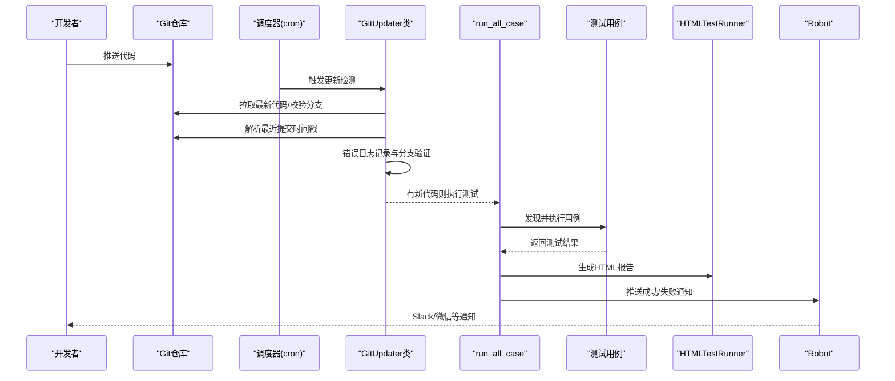

**图示来源**
- [autoGitPull.py:114-192](file://autoGitPull.py#L114-L192)
- [run_all_case.py:12-159](file://run_all_case.py#L12-L159)
- [common/HTMLTestRunner.py:516-705](file://common/HTMLTestRunner.py#L516-L705)
- [Robot.py:6-138](file://Robot.py#L6-L138)

## 详细组件分析

### 现代化Git代码更新器（GitUpdater类）
**更新** autoGitPull.py已从简单脚本演进为强大的GitUpdater类，实现了完整的面向对象设计。

- **类设计特点**
  - 面向对象架构：使用GitUpdater类封装所有Git更新相关功能
  - 集中式配置管理：通过APP_CONFIGS常量和_config方法管理应用配置
  - 多实例日志记录：分别记录代码拉取、更新和错误信息
  - 增强错误处理：完整的异常捕获和日志记录机制
- **核心功能**
  - 应用配置映射：支持多应用（bb_php、bb_go、pt、slp_php、slp_common_rpc）与对应路径、分支、机器人标识
  - 分支一致性校验：拉取后读取当前分支并与期望分支对比，不一致直接返回失败
  - 提交时间戳比较：解析最近提交时间，与本地时间戳文件对比，判断是否需要触发测试
  - 通知策略：根据应用类型选择不同的通知通道与内容格式
- **关键流程**

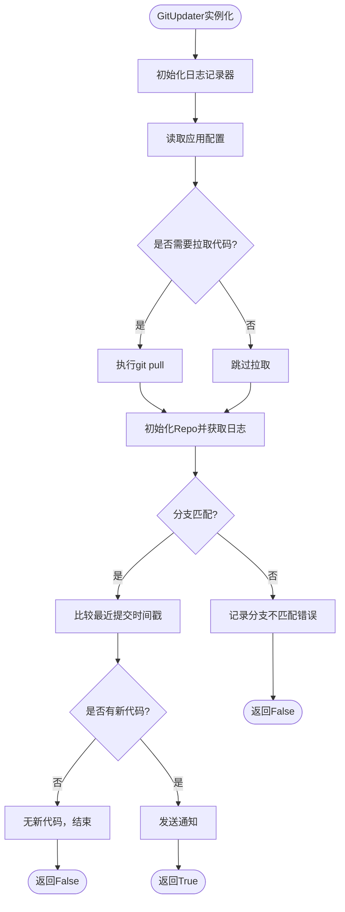

**图示来源**
- [autoGitPull.py:56-192](file://autoGitPull.py#L56-L192)
- [autoGitPull.py:194-229](file://autoGitPull.py#L194-L229)

**章节来源**
- [autoGitPull.py:18-49](file://autoGitPull.py#L18-L49)
- [autoGitPull.py:56-192](file://autoGitPull.py#L56-L192)
- [autoGitPull.py:194-229](file://autoGitPull.py#L194-L229)

### 集中式配置管理（Config类）
**更新** 配置管理已从简单的字典结构演进为完整的Config类，提供了更好的类型安全和功能扩展。

- **功能要点**
  - 统一管理应用域名、路径、分支、用户ID、房间ID、支付URL等
  - 通过appName与linux_node区分不同执行环境与应用
  - 支持多环境配置（dev、pt、slp等）
  - 提供类型注解增强代码可维护性
- **关键流程**

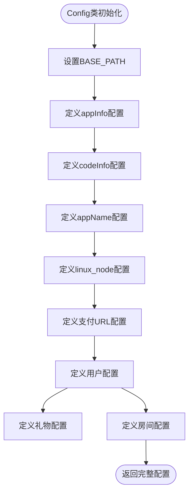

**图示来源**
- [common/Config.py:6-133](file://common/Config.py#L6-L133)

**章节来源**
- [common/Config.py:6-133](file://common/Config.py#L6-L133)

### 会话管理（Session类）
**新增** Session类提供了统一的会话管理功能，支持多种环境的用户登录和token管理。

- **功能要点**
  - 支持多种环境：dev、rush、PT、SLP等
  - 统一的登录流程：通过Basic.yml配置文件管理登录参数
  - 备份方案：当默认方案失败时自动切换到备用方案
  - Token持久化：将获取的token保存到文件中
- **关键流程**

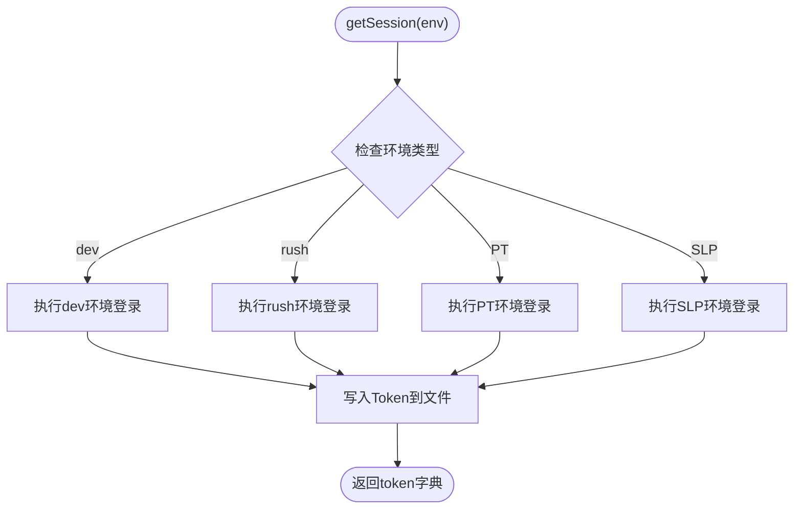

**图示来源**
- [common/Session.py:19-166](file://common/Session.py#L19-L166)

**章节来源**
- [common/Session.py:13-200](file://common/Session.py#L13-L200)

### 测试调度与执行（run_all_case）
- **功能要点**
  - 按节点与应用选择用例目录（case、caseOversea、caseSlp等）
  - 使用unittest加载器批量发现并执行测试用例
  - 统计执行时长、用例总数、失败/错误数量，并写入日志
  - 成功/失败时通过机器人推送摘要与详情
- **关键流程**

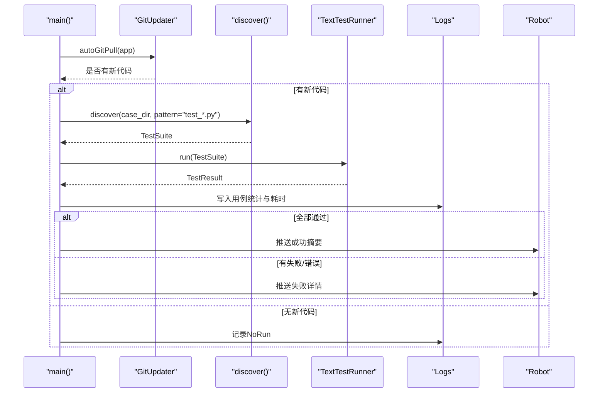

**图示来源**
- [run_all_case.py:12-159](file://run_all_case.py#L12-L159)

**章节来源**
- [run_all_case.py:12-159](file://run_all_case.py#L12-L159)

### 定时任务调度（run_crontab_case）
- **功能要点**
  - 针对"派对"与"APP"两类应用，分别发现并执行特定用例或通配用例
  - 执行完成后生成统计日志并推送markdown通知
- **关键流程**

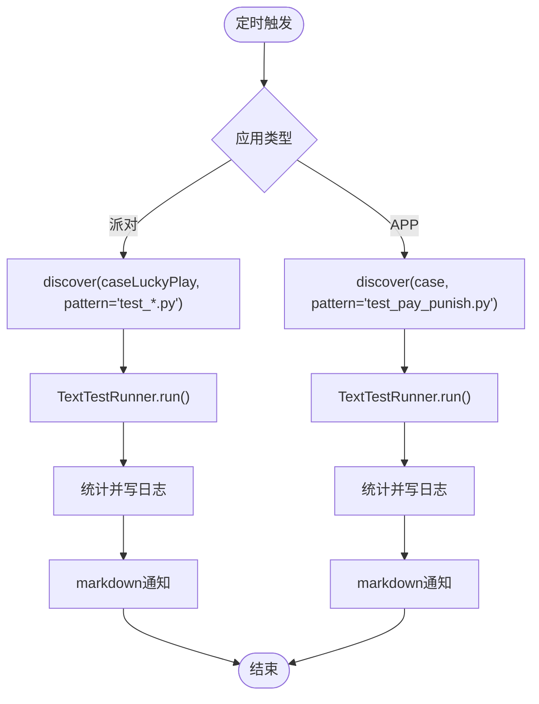

**图示来源**
- [run_crontab_case.py:9-79](file://run_crontab_case.py#L9-L79)

**章节来源**
- [run_crontab_case.py:9-79](file://run_crontab_case.py#L9-L79)

### HTML测试报告生成（common/HTMLTestRunner）
- **功能要点**
  - 基于unittest扩展，自动生成HTML报告，包含统计、饼图、用例明细与输出重定向
  - 提供排序、模板拼装、样式与脚本注入，便于浏览器端交互查看
- **关键流程**

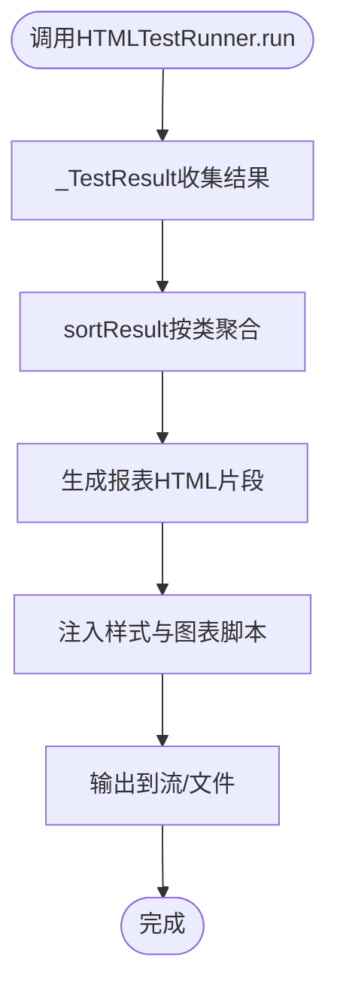

**图示来源**
- [common/HTMLTestRunner.py:516-705](file://common/HTMLTestRunner.py#L516-L705)

**章节来源**
- [common/HTMLTestRunner.py:516-705](file://common/HTMLTestRunner.py#L516-L705)

### 失败重试机制（common/runFailed）
- **功能要点**
  - 类/函数级重试装饰器，支持最大重试次数与按测试函数前缀筛选
  - 在每次重试前执行 tearDown 与 setUp，保证测试上下文一致性
- **关键流程**

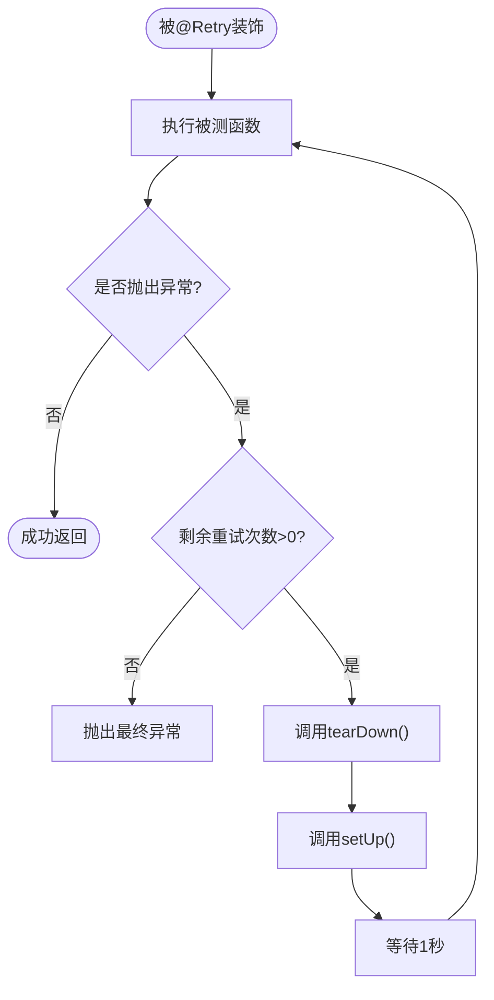

**图示来源**
- [common/runFailed.py:57-87](file://common/runFailed.py#L57-L87)

**章节来源**
- [common/runFailed.py:10-87](file://common/runFailed.py#L10-L87)

### 通知系统（Robot）
- **功能要点**
  - 支持多种模式：fail、success、markdown、icon、slack、slack_pt
  - 根据to参数选择目标渠道（如to='slack'），并按bot类型选择URL
  - 统一封装HTTP请求与异常处理
- **关键流程**

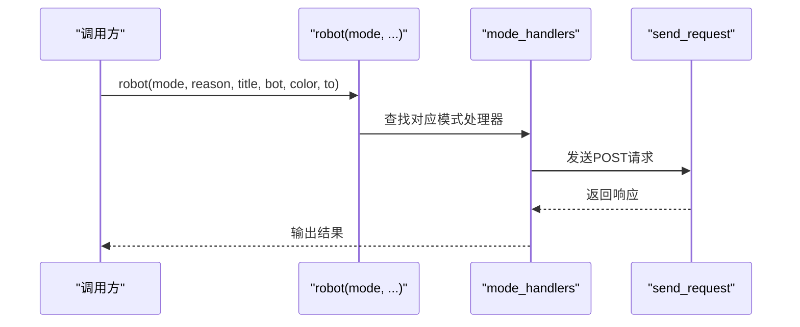

**图示来源**
- [Robot.py:6-138](file://Robot.py#L6-L138)

**章节来源**
- [Robot.py:6-138](file://Robot.py#L6-L138)

### 日志系统（common/Logs）
- **功能要点**
  - 基于TimedRotatingFileHandler按午夜轮转日志文件，避免单文件过大
  - 同时输出到控制台与文件，便于开发调试与生产留存
- **关键流程**

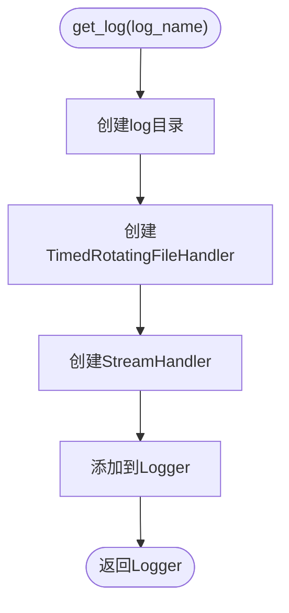

**图示来源**
- [common/Logs.py:8-48](file://common/Logs.py#L8-L48)

**章节来源**
- [common/Logs.py:8-48](file://common/Logs.py#L8-L48)

### 全局常量管理（common/Consts）
**更新** 全局常量管理已从简单的字典结构演进为完整的Consts模块。

- **功能要点**
  - 统一管理测试执行过程中的全局变量
  - 支持用例列表、失败原因、时间记录等
  - 提供并发执行结果统计
- **关键流程**

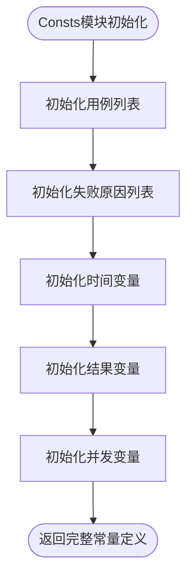

**图示来源**
- [common/Consts.py:1-17](file://common/Consts.py#L1-L17)

**章节来源**
- [common/Consts.py:1-17](file://common/Consts.py#L1-L17)

## 依赖分析
- **外部依赖**
  - pytest、GitPython、requests、PyMySQL、redis、allure等，用于测试框架、Git操作、HTTP请求、数据库与报告生成
- **内部依赖**
  - run_all_case 与 run_crontab_case 依赖 GitUpdater、HTMLTestRunner、Robot、Logs、Config、Session
  - 测试用例依赖 common 下的 Request、Assert、runFailed、Consts、basicData 等
  - GitUpdater 依赖 Config、Session、Logs、Consts、Robot

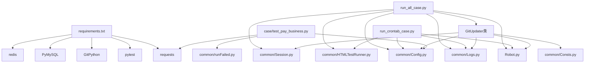

**图示来源**
- [requirements.txt:1-85](file://requirements.txt#L1-L85)
- [run_all_case.py:12-159](file://run_all_case.py#L12-L159)
- [run_crontab_case.py:9-79](file://run_crontab_case.py#L9-L79)
- [autoGitPull.py:56-192](file://autoGitPull.py#L56-L192)
- [case/test_pay_business.py:1-189](file://case/test_pay_business.py#L1-L189)

**章节来源**
- [requirements.txt:1-85](file://requirements.txt#L1-L85)

## 性能考虑
- **并发与资源**
  - 当前脚本以顺序执行为主，建议在CI中结合pytest-xdist进行分布式并发执行，减少总耗时
  - GitUpdater类的多实例设计支持并行处理多个应用的代码更新检测
- **报告生成**
  - HTML报告包含图表与大量DOM，建议在CI中仅保留关键摘要，或将报告产物归档到制品库
- **日志轮转**
  - 使用TimedRotatingFileHandler按午夜轮转，避免磁盘占用过大
  - GitUpdater类的多日志记录器设计确保不同类型信息的独立追踪
- **网络与数据库**
  - 请求与数据库操作建议增加超时与重试策略，避免偶发网络抖动影响整体稳定性
  - Session类的备份方案提高了登录成功率
- **重试策略**
  - 失败重试仅适用于可幂等的测试，建议配合幂等性设计与隔离环境，避免副作用
- **配置管理**
  - 集中式配置管理减少了重复配置，提高了配置的一致性和可维护性

## 故障排除指南
- **Git分支不匹配**
  - 现象：GitUpdater返回False并记录分支不匹配错误
  - 处理：确认codeInfo中的期望分支与实际分支一致，修正后重新触发
  - 日志定位：查看gitBranchError.log中的具体错误信息
- **无新代码**
  - 现象：GitUpdater提示无新代码，run_all_case记录NoRun
  - 处理：检查time.txt时间戳文件与最近提交时间，必要时手动刷新
  - 日志定位：查看updateGitCode.log中的时间戳比较信息
- **通知失败**
  - 现象：Robot无法发送消息
  - 处理：检查robot_dict中对应bot的URL配置，确认网络连通性与权限
  - 日志定位：查看通知发送的异常信息
- **报告生成异常**
  - 现象：HTML报告为空或报错
  - 处理：检查HTMLTestRunner依赖与输出流，确保测试执行阶段未阻塞
- **重试无效**
  - 现象：@Retry未生效
  - 处理：确认被测函数/类命名符合约定，max_n与func_prefix配置正确
- **配置加载失败**
  - 现象：Config类无法正确加载配置
  - 处理：检查Basic.yml文件格式和路径配置，确认配置项完整性
- **会话获取失败**
  - 现象：Session类无法获取有效token
  - 处理：检查Basic.yml中的登录参数配置，确认网络连通性和备用方案
  - 日志定位：查看getSession.log中的详细错误信息

**章节来源**
- [autoGitPull.py:164-167](file://autoGitPull.py#L164-L167)
- [autoGitPull.py:189-191](file://autoGitPull.py#L189-L191)
- [Robot.py:36-44](file://Robot.py#L36-L44)
- [common/HTMLTestRunner.py:516-705](file://common/HTMLTestRunner.py#L516-L705)
- [common/runFailed.py:57-87](file://common/runFailed.py#L57-L87)
- [common/Config.py:6-133](file://common/Config.py#L6-L133)
- [common/Session.py:19-166](file://common/Session.py#L19-L166)

## 结论
本项目已具备完善的自动化测试基础：现代化的Git更新检测、测试调度、报告生成、失败重试与通知系统。通过GitUpdater类的面向对象设计、集中式配置管理和增强的错误处理机制，项目在可靠性、可维护性和扩展性方面都有显著提升。结合CI平台的定时触发与并发执行，可进一步提升交付效率与质量稳定性。建议在CI中引入制品归档、邮件/IM通知分级与失败重试策略优化，持续完善测试体系。

## 附录

### CI/CD集成方案（Jenkins/GitLab CI）
- **Jenkins**
  - 触发方式：SCM轮询或Webhook触发构建
  - 步骤建议：
    - 安装Python与依赖（requirements.txt）
    - 执行 run_all_case.py 或 run_crontab_case.py
    - 生成HTML报告并归档制品
    - 失败时通过插件发送通知
  - **更新** 建议使用GitUpdater类的多实例并行处理多个应用的代码更新检测
- **GitLab CI**
  - 触发方式：push/merge事件或定时任务
  - 步骤建议：
    - 使用Python镜像安装依赖
    - 运行测试脚本并生成报告
    - 使用artifacts上传报告与日志
    - 失败时通过CI Job通知

### 最佳实践
- **用例设计**
  - 单一职责、可重复、可隔离；避免跨用例共享状态
- **数据准备**
  - 使用数据库预置与清理脚本，确保测试前后数据一致性
- **环境隔离**
  - 不同应用/环境使用独立配置与数据库，避免相互污染
- **失败重试**
  - 仅对可幂等操作启用重试，合理设置重试次数与退避策略
- **报告与通知**
  - CI中保留关键摘要，详细报告归档；通知按严重程度分级
- **配置管理**
  - 使用Config类的集中式配置管理，确保配置的一致性和可维护性
- **日志记录**
  - 利用GitUpdater类的多日志记录器设计，确保问题排查的便利性

### 监控与质量报告
- **执行状态**
  - 通过日志与通知通道实时掌握测试执行状态
  - **更新** 利用GitUpdater类的详细日志记录功能，包括代码拉取、分支验证和错误处理
- **结果分析**
  - 利用HTML报告与CI制品对比趋势，识别回归与波动
- **质量度量**
  - 关注通过率、失败率、平均耗时、重试比例等指标，持续优化
  - **更新** 新增Git代码更新检测成功率、分支验证通过率等指标