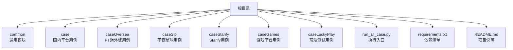
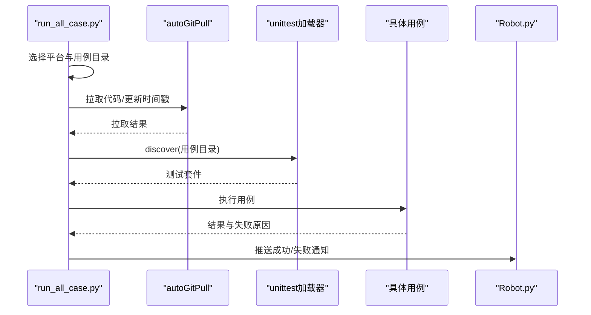
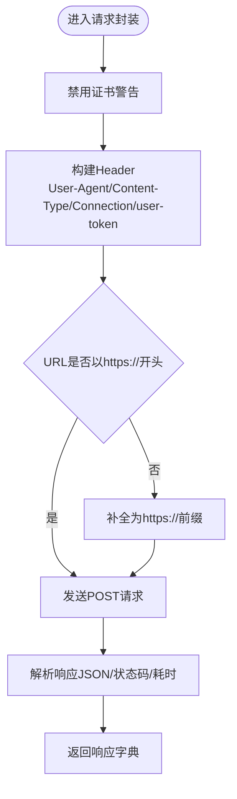
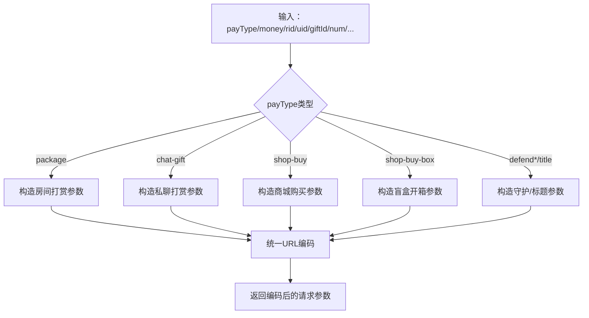
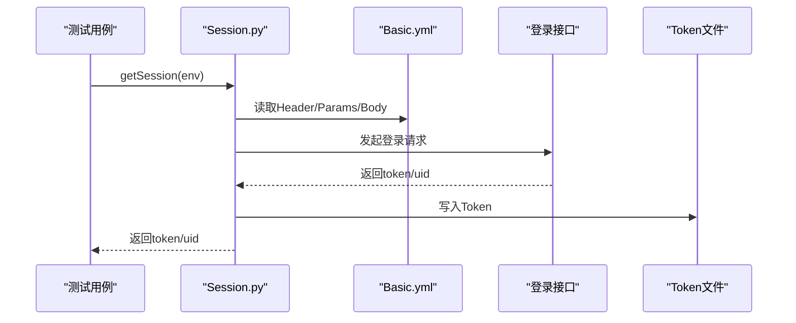
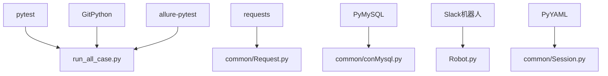

# 项目概述

<cite>
**本文档引用的文件**
- [README.md](file://README.md)
- [requirements.txt](file://requirements.txt)
- [run_all_case.py](file://run_all_case.py)
- [common/Config.py](file://common/Config.py)
- [common/Consts.py](file://common/Consts.py)
- [common/Request.py](file://common/Request.py)
- [common/basicData.py](file://common/basicData.py)
- [common/Session.py](file://common/Session.py)
- [common/conMysql.py](file://common/conMysql.py)
- [common/Assert.py](file://common/Assert.py)
- [Robot.py](file://Robot.py)
</cite>

## 更新摘要
**所做更改**
- 整合原有README.md中的项目概述内容到现有文档结构
- 更新项目目标和技术架构描述，反映多平台支付测试自动化特性
- 完善支付场景覆盖范围说明，包括新增的Starify平台支持
- 补充技术栈概览和依赖分析，体现完整的测试生态系统
- 优化架构图示，展示分层架构与模块化设计

## 目录
1. [引言](#引言)
2. [项目结构](#项目结构)
3. [核心组件](#核心组件)
4. [架构总览](#架构总览)
5. [详细组件分析](#详细组件分析)
6. [依赖分析](#依赖分析)
7. [性能考虑](#性能考虑)
8. [故障排查指南](#故障排查指南)
9. [结论](#结论)
10. [附录](#附录)

## 引言
本项目是支付模块的自动化测试框架，专为QA支付测试自动化而设计，支持多种支付场景的测试，包括金豆支付、金币支付、商城购买、房间支付等。项目采用Python + pytest + requests + PyMySQL + GitPython + Slack机器人通知的技术栈，实现了跨平台、多场景的支付测试自动化解决方案。

项目覆盖以下平台与场景：
- **平台支持**：BanBan（国内）、PT海外版（多语言/多大区）、不夜星球（SLP）、Starify平台
- **支付场景**：房间打赏、私聊打赏、盲盒开箱、商城购买、守护/房间守护、标题购买、联合/家族房等
- **技术架构**：分层架构与模块化设计，支持持续集成与自动化执行

项目通过统一的请求封装、参数编码、数据库前置/后置处理、断言封装与报告输出，形成可扩展、可维护的测试体系，满足多平台支付测试的自动化需求。

**章节来源**
- [README.md:1-103](file://README.md#L1-L103)

## 项目结构
项目采用按平台与功能分层的组织方式，结构清晰、职责明确：

- **根目录**：入口脚本、运行器、依赖清单、README说明文档
- **common**：通用能力模块（配置、请求、会话、断言、数据库操作、日志、报告等）
- **case**：国内平台（BanBan）相关用例
- **caseOversea**：PT海外版相关用例
- **caseSlp**：不夜星球（SLP）相关用例
- **caseStarify**：Starify平台相关用例（当前注释未启用）
- **caseGames**：游戏平台相关用例
- **caseLuckyPlay**：各类玩法测试用例
- **others**：辅助脚本与配置
- **probabilityTest**：概率玩法测试（盲盒、转盘等）



**图表来源**
- [README.md:9-20](file://README.md#L9-L20)
- [run_all_case.py:126-147](file://run_all_case.py#L126-L147)

**章节来源**
- [README.md:7-20](file://README.md#L7-L20)

## 核心组件
项目的核心组件围绕支付测试的完整生命周期设计，每个组件都有明确的职责和协作关系：

- **配置中心**：集中管理各平台域名、登录URL、用户/房间/礼物配置、代码分支等
- **请求封装**：统一HTTP请求、Header注入、Token读取、响应解析与耗时统计
- **数据编码**：按支付场景构造参数（房间打赏、私聊打赏、商城购买、盲盒等）
- **会话管理**：登录态获取与持久化（Token写入/读取）
- **数据库操作**：前置/后置数据准备与清理、余额/背包/守护等查询
- **断言封装**：统一断言方法（状态码、返回体字段、数值范围、文本包含等）
- **执行调度**：按平台选择用例目录、自动发现、并发控制、失败重试、通知机器人
- **报告与通知**：用例结果汇总、失败原因收集、Slack/微信机器人推送

**章节来源**
- [common/Config.py:15-243](file://common/Config.py#L15-L243)
- [common/Request.py:13-86](file://common/Request.py#L13-L86)
- [common/basicData.py:8-581](file://common/basicData.py#L8-L581)
- [common/Session.py:16-144](file://common/Session.py#L16-L144)
- [common/conMysql.py:8-530](file://common/conMysql.py#L8-L530)
- [common/Assert.py:16-167](file://common/Assert.py#L16-L167)
- [run_all_case.py:12-163](file://run_all_case.py#L12-L163)

## 架构总览
系统采用分层架构与模块化设计，确保各层职责清晰、耦合度低：

- **表现层**：pytest用例（按平台划分）
- **控制层**：执行入口与调度（run_all_case.py）
- **业务层**：请求封装、参数编码、断言封装
- **数据访问层**：数据库操作（PyMySQL）
- **通知层**：Slack/微信机器人

```mermaid
graph TB
subgraph "表现层"
T1["pytest用例<br/>case/*, caseOversea/*, caseSlp/*"]
end
subgraph "控制层"
R["run_all_case.py<br/>平台选择/用例发现/执行/通知"]
end
subgraph "业务层"
REQ["Request.py<br/>HTTP请求封装"]
BD["basicData.py<br/>参数编码"]
AS["Assert.py<br/>断言封装"]
SESS["Session.py<br/>登录态管理"]
END
subgraph "数据访问层"
DB["conMysql.py<br/>数据库操作"]
CFG["Config.py<br/>配置中心"]
END
subgraph "通知层"
ROBOT["Robot.py<br/>Slack/微信通知"]
END
T1 --> REQ
T1 --> BD
T1 --> AS
T1 --> DB
T1 --> CFG
R --> T1
R --> ROBOT
REQ --> SESS
REQ --> DB
```

**图表来源**
- [run_all_case.py:126-147](file://run_all_case.py#L126-L147)
- [common/Request.py:13-86](file://common/Request.py#L13-L86)
- [common/basicData.py:8-581](file://common/basicData.py#L8-L581)
- [common/Assert.py:16-167](file://common/Assert.py#L16-L167)
- [common/Session.py:16-144](file://common/Session.py#L16-L144)
- [common/conMysql.py:8-530](file://common/conMysql.py#L8-L530)
- [common/Config.py:15-243](file://common/Config.py#L15-L243)
- [Robot.py:6-89](file://Robot.py#L6-L89)

## 详细组件分析

### 组件A：执行入口与调度（run_all_case.py）
执行入口负责根据主机节点选择平台，自动拉取代码，发现并执行对应目录下的测试用例，统计结果并通过机器人推送。

- **功能**：根据主机节点选择平台，自动拉取代码，发现并执行对应目录下的测试用例，统计结果并通过机器人推送
- **关键流程**：
  - 平台识别与分支判断
  - 自动拉取代码与更新时间戳
  - 用例发现（unittest.defaultTestLoader.discover）
  - 结果统计与失败原因收集
  - 通知机器人（Slack/微信）



**图表来源**
- [run_all_case.py:12-163](file://run_all_case.py#L12-L163)
- [Robot.py:6-89](file://Robot.py#L6-L89)

**章节来源**
- [run_all_case.py:12-163](file://run_all_case.py#L12-L163)

### 组件B：请求封装（common/Request.py）
封装POST请求，统一Header（含User-Agent、Content-Type、Connection、user-token），支持HTTPS、异常处理、响应解析与耗时统计。

- **功能**：封装POST请求，统一Header（含User-Agent、Content-Type、Connection、user-token），支持HTTPS、异常处理、响应解析与耗时统计
- **使用**：各平台用例通过该模块发起支付请求



**图表来源**
- [common/Request.py:13-86](file://common/Request.py#L13-L86)

**章节来源**
- [common/Request.py:13-86](file://common/Request.py#L13-L86)

### 组件C：参数编码（common/basicData.py）
按支付场景构造请求参数（房间打赏、私聊打赏、商城购买、盲盒、守护、标题等），支持多用户、多礼物、多数量组合。

- **功能**：按支付场景构造请求参数（房间打赏、私聊打赏、商城购买、盲盒、守护、标题等），支持多用户、多礼物、多数量组合
- **场景覆盖**：
  - 国内平台：房间打赏、私聊打赏、商城购买、盲盒开箱、守护升级/解除等
  - PT海外版：房间打赏、私聊打赏、商城购买（金豆/钻石）、盲盒、转盘、星球抽奖等
  - SLP：房间打赏、商城购买、守护、箱子等



**图表来源**
- [common/basicData.py:8-581](file://common/basicData.py#L8-L581)

**章节来源**
- [common/basicData.py:8-581](file://common/basicData.py#L8-L581)

### 组件D：会话与登录（common/Session.py）
按环境获取登录Token，支持默认方案与备选方案（数据库取token），Token持久化到本地文件。

- **功能**：按环境获取登录Token，支持默认方案与备选方案（数据库取token），Token持久化到本地文件
- **平台适配**：国内、PT海外版、不夜星球等



**图表来源**
- [common/Session.py:55-122](file://common/Session.py#L55-L122)

**章节来源**
- [common/Session.py:55-122](file://common/Session.py#L55-L122)

### 组件E：数据库操作（common/conMysql.py）
提供账户余额、背包、守护、消费记录等查询与更新；支持批量清理、插入、校验。

- **功能**：提供账户余额、背包、守护、消费记录等查询与更新；支持批量清理、插入、校验
- **用法**：用例执行前后进行数据准备与清理，确保测试隔离性

**章节来源**
- [common/conMysql.py:28-204](file://common/conMysql.py#L28-L204)
- [common/conMysql.py:206-273](file://common/conMysql.py#L206-L273)
- [common/conMysql.py:275-322](file://common/conMysql.py#L275-L322)
- [common/conMysql.py:324-530](file://common/conMysql.py#L324-L530)

### 组件F：断言封装（common/Assert.py）
统一断言方法（状态码、返回体字段、长度、相等、范围、文本包含），失败时收集原因。

- **功能**：统一断言方法（状态码、返回体字段、长度、相等、范围、文本包含），失败时收集原因

**章节来源**
- [common/Assert.py:16-167](file://common/Assert.py#L16-L167)

### 组件G：平台配置（common/Config.py）
集中管理各平台域名、登录URL、用户/房间/礼物ID、代码分支等。

- **功能**：集中管理各平台域名、登录URL、用户/房间/礼物ID、代码分支等

**章节来源**
- [common/Config.py:15-243](file://common/Config.py#L15-L243)

### 组件H：全局常量（common/Consts.py）
全局用例列表、失败原因列表、时间戳、并发计数等。

- **功能**：全局用例列表、失败原因列表、时间戳、并发计数等

**章节来源**
- [common/Consts.py:1-17](file://common/Consts.py#L1-L17)

### 组件I：通知机器人（Robot.py）
支持多种模式（成功/失败/Markdown/Slack/Slack_PT），向Slack/微信推送测试结果。

- **功能**：支持多种模式（成功/失败/Markdown/Slack/Slack_PT），向Slack/微信推送测试结果

**章节来源**
- [Robot.py:6-89](file://Robot.py#L6-L89)

## 依赖分析
项目依赖以pytest为核心，结合requests、PyMySQL、GitPython等第三方库，形成稳定的测试生态。



**图表来源**
- [requirements.txt:4-6](file://requirements.txt#L4-L6)
- [requirements.txt:11-14](file://requirements.txt#L11-L14)
- [requirements.txt:22-23](file://requirements.txt#L22-L23)
- [requirements.txt:50-52](file://requirements.txt#L50-L52)
- [requirements.txt:89-90](file://requirements.txt#L89-L90)

**章节来源**
- [requirements.txt:1-91](file://requirements.txt#L1-L91)

## 性能考虑
- **请求超时与重试**：部分断言对RPC接口延迟做了等待，避免误判
- **日志与耗时**：请求封装中记录毫秒级耗时，便于定位慢接口
- **并发与资源**：执行入口提供并发计数变量，便于后续扩展
- **数据准备**：数据库操作采用批量清理与插入，减少重复SQL

**章节来源**
- [common/Assert.py:16-24](file://common/Assert.py#L16-L24)
- [common/Request.py:33-47](file://common/Request.py#L33-L47)
- [common/Consts.py:14-17](file://common/Consts.py#L14-L17)

## 故障排查指南
- **登录失败**：检查Basic.yml中的Header/Params/Body是否正确，确认Session写入Token是否成功
- **数据库异常**：确认连接参数、库名、表名是否匹配，关注事务回滚与提交
- **断言失败**：查看失败原因收集列表，核对期望值与实际返回体
- **通知失败**：检查机器人URL配置，确认网络可达性
- **用例执行异常**：查看执行入口的日志记录，确认平台选择与用例发现逻辑

**章节来源**
- [common/Session.py:86-122](file://common/Session.py#L86-L122)
- [common/conMysql.py:344-360](file://common/conMysql.py#L344-L360)
- [common/Assert.py:26-43](file://common/Assert.py#L26-L43)
- [Robot.py:13-23](file://Robot.py#L13-L23)
- [run_all_case.py:140-153](file://run_all_case.py#L140-L153)

## 结论
本项目通过统一的请求封装、参数编码、数据库操作与断言封装，实现了多平台、多场景的支付测试自动化。其模块化与分层设计便于扩展与维护，配合Slack通知与Git自动拉取，满足持续集成与快速反馈的需求。项目支持BanBan、PT海外版、不夜星球、Starify等多个平台，覆盖房间打赏、私聊打赏、盲盒开箱、商城购买等丰富的支付场景，为QA支付测试提供了完整的自动化解决方案。

## 附录

### 支付场景与用例映射
- **国内平台（BanBan）**
  - 商城购买：[case/test_pay_shopBuy.py](file://case/test_pay_shopBuy.py)
  - 盲盒开箱：[case/test_pay_openBox.py](file://case/test_pay_openBox.py)
- **PT海外版**
  - 商城购买（金豆/钻石）：[caseOversea/test_pt_shopBuy.py](file://caseOversea/test_pt_shopBuy.py)
  - 盲盒开箱：[caseOversea/test_pt_openBox.py](file://caseOversea/test_pt_openBox.py)
- **不夜星球（SLP）**
  - 配置与工具：[caseSlp/config.py](file://caseSlp/config.py)、[caseSlp/tools.py](file://caseSlp/tools.py)
- **Starify平台**
  - 合同支付：[caseStarify/test_starify_contractPay.py](file://caseStarify/test_starify_contractPay.py)
  - 房间礼物：[caseStarify/test_starify_roomGift.py](file://caseStarify/test_starify_roomGift.py)
  - 商店支付：[caseStarify/test_starify_shopPay.py](file://caseStarify/test_starify_shopPay.py)
  - 工作礼物：[caseStarify/test_starify_workGift.py](file://caseStarify/test_starify_workGift.py)

**章节来源**
- [README.md:87-97](file://README.md#L87-L97)
- [case/test_pay_shopBuy.py](file://case/test_pay_shopBuy.py)
- [case/test_pay_openBox.py](file://case/test_pay_openBox.py)
- [caseOversea/test_pt_shopBuy.py](file://caseOversea/test_pt_shopBuy.py)
- [caseOversea/test_pt_openBox.py](file://caseOversea/test_pt_openBox.py)
- [caseSlp/config.py](file://caseSlp/config.py)
- [caseSlp/tools.py](file://caseSlp/tools.py)
- [caseStarify/test_starify_contractPay.py](file://caseStarify/test_starify_contractPay.py)
- [caseStarify/test_starify_roomGift.py](file://caseStarify/test_starify_roomGift.py)
- [caseStarify/test_starify_shopPay.py](file://caseStarify/test_starify_shopPay.py)
- [caseStarify/test_starify_workGift.py](file://caseStarify/test_starify_workGift.py)