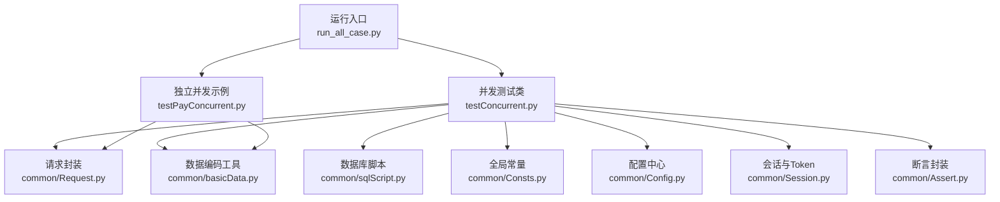
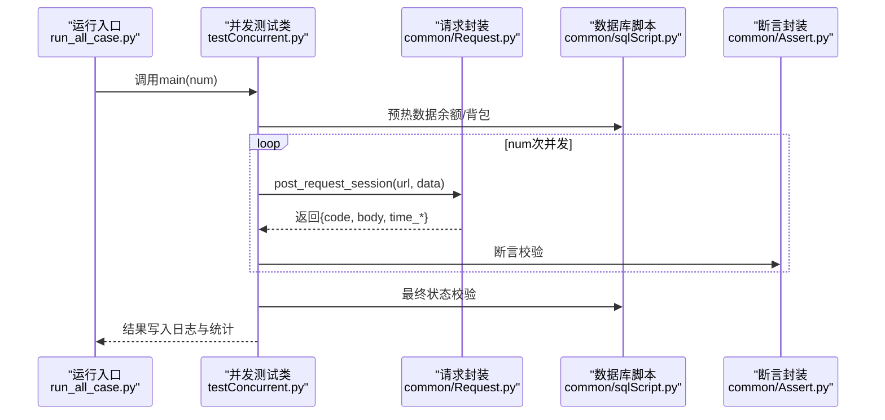
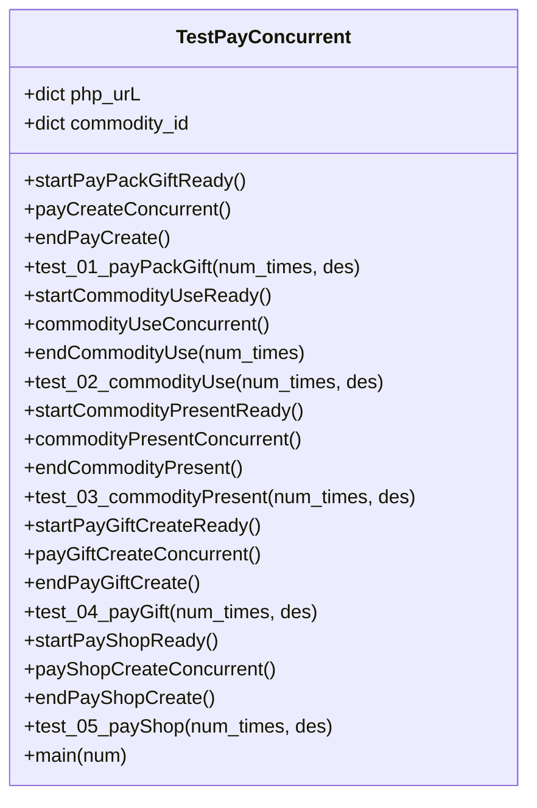
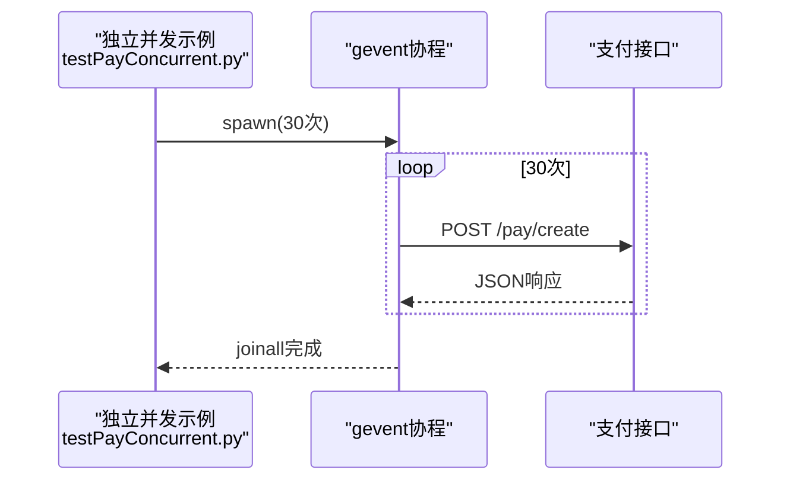
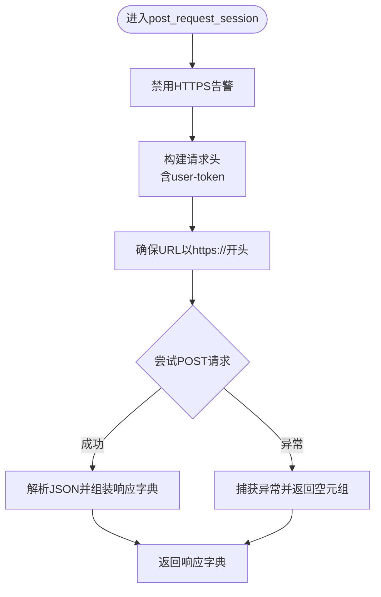
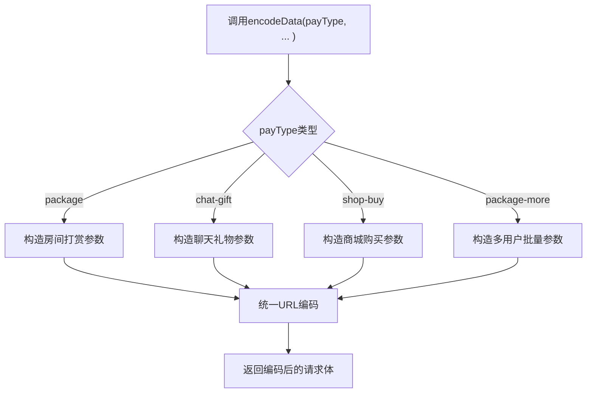
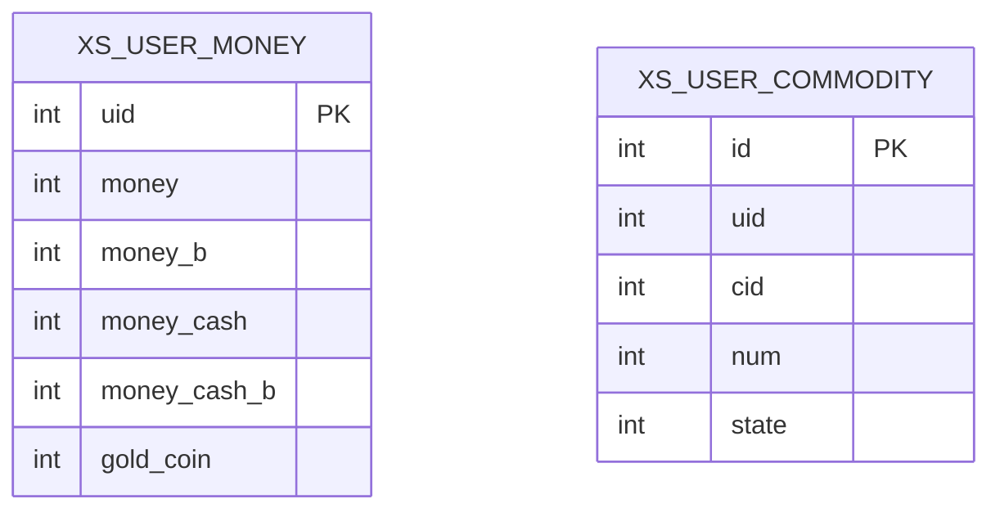
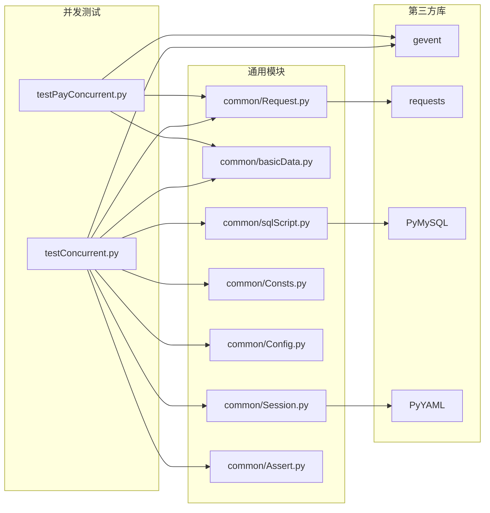

# 并发测试

<cite>
**本文引用的文件**
- [testConcurrent.py](file://testConcurrent.py)
- [testPayConcurrent.py](file://testPayConcurrent.py)
- [run_all_case.py](file://run_all_case.py)
- [common/Config.py](file://common/Config.py)
- [common/Consts.py](file://common/Consts.py)
- [common/Request.py](file://common/Request.py)
- [common/basicData.py](file://common/basicData.py)
- [common/sqlScript.py](file://common/sqlScript.py)
- [common/Session.py](file://common/Session.py)
- [common/Assert.py](file://common/Assert.py)
- [requirements.txt](file://requirements.txt)
- [README.md](file://README.md)
</cite>

## 目录
1. [简介](#简介)
2. [项目结构](#项目结构)
3. [核心组件](#核心组件)
4. [架构总览](#架构总览)
5. [详细组件分析](#详细组件分析)
6. [依赖分析](#依赖分析)
7. [性能考量](#性能考量)
8. [故障排查指南](#故障排查指南)
9. [结论](#结论)
10. [附录](#附录)

## 简介
本文件面向QA支付测试自动化项目的并发测试能力，系统化阐述并发测试的设计原理、实现架构与执行策略。重点覆盖：
- 如何通过协程库实现高并发支付场景模拟
- 并发用户模拟、请求负载均衡与资源竞争条件处理
- 关键挑战：数据库锁竞争、支付幂等性保证、事务一致性维护
- 并发测试配置参数、性能指标监控与瓶颈分析方法
- 使用gevent等并发库的高效实现思路与合理并发场景设计

## 项目结构
项目采用分层与按功能域划分的组织方式：
- 测试入口与调度：run_all_case.py
- 并发测试实现：testConcurrent.py、testPayConcurrent.py
- 通用支撑：common/*（配置、请求封装、SQL脚本、断言、会话管理等）
- 依赖声明：requirements.txt
- 项目说明：README.md

图表来源
- [run_all_case.py:12-159](file://run_all_case.py#L12-L159)
- [testConcurrent.py:17-281](file://testConcurrent.py#L17-L281)
- [testPayConcurrent.py:9-47](file://testPayConcurrent.py#L9-L47)
- [common/Request.py:17-59](file://common/Request.py#L17-L59)
- [common/basicData.py:8-325](file://common/basicData.py#L8-L325)
- [common/sqlScript.py:5-145](file://common/sqlScript.py#L5-L145)
- [common/Consts.py:4-17](file://common/Consts.py#L4-L17)
- [common/Config.py:6-133](file://common/Config.py#L6-L133)
- [common/Session.py:13-200](file://common/Session.py#L13-L200)
- [common/Assert.py:11-96](file://common/Assert.py#L11-L96)

章节来源
- [run_all_case.py:12-159](file://run_all_case.py#L12-L159)
- [README.md:1-38](file://README.md#L1-L38)

## 核心组件
- 并发测试类：封装支付相关的并发场景，统一使用gevent协程池发起请求，配合数据库预热与断言校验。
- 请求封装：统一HTTP请求头、超时与错误处理，返回标准化响应字典。
- 数据编码：根据支付类型动态拼装请求参数，确保请求体格式正确。
- SQL脚本：提供余额、背包道具等数据库操作的便捷方法。
- 全局常量：记录并发统计、用例结果与时间戳。
- 配置中心：集中管理域名、用户ID、礼物ID等配置。
- 会话与Token：自动获取并持久化用户Token，保障请求合法性。
- 断言封装：统一断言逻辑，记录失败原因便于定位问题。

章节来源
- [testConcurrent.py:17-281](file://testConcurrent.py#L17-L281)
- [common/Request.py:17-59](file://common/Request.py#L17-L59)
- [common/basicData.py:8-325](file://common/basicData.py#L8-L325)
- [common/sqlScript.py:5-145](file://common/sqlScript.py#L5-L145)
- [common/Consts.py:4-17](file://common/Consts.py#L4-L17)
- [common/Config.py:6-133](file://common/Config.py#L6-L133)
- [common/Session.py:13-200](file://common/Session.py#L13-L200)
- [common/Assert.py:11-96](file://common/Assert.py#L11-L96)

## 架构总览
并发测试的整体流程如下：
- 初始化会话与Token
- 预热数据库（构造测试数据）
- 启动gevent协程池，批量提交支付/道具使用/赠送等请求
- 统一等待协程完成
- 校验最终数据库状态与统计计数
- 输出日志与机器人通知

图表来源
- [run_all_case.py:12-159](file://run_all_case.py#L12-L159)
- [testConcurrent.py:266-281](file://testConcurrent.py#L266-L281)
- [common/Request.py:17-59](file://common/Request.py#L17-L59)
- [common/sqlScript.py:29-124](file://common/sqlScript.py#L29-L124)
- [common/Assert.py:11-96](file://common/Assert.py#L11-L96)

## 详细组件分析

### 并发测试类（testConcurrent.py）
该类是并发测试的核心，负责：
- 支付场景构造与校验（购买礼物、房间打赏、道具使用/赠送）
- gevent协程池的创建与join
- 全局统计与结果记录

关键点：
- 协程池创建：循环中spawn多个协程，最后joinall等待全部完成
- 场景隔离：每个测试方法独立准备数据、并发执行、独立断言
- 统计计数：通过全局success_num/fail_num进行并发结果汇总

图表来源
- [testConcurrent.py:17-281](file://testConcurrent.py#L17-L281)

章节来源
- [testConcurrent.py:17-281](file://testConcurrent.py#L17-L281)

### 独立并发示例（testPayConcurrent.py）
该文件展示了最简并发模式：
- 使用requests直接发送请求
- 通过gevent.spawn并发触发相同请求
- 适合快速验证接口在高并发下的稳定性

图表来源
- [testPayConcurrent.py:18-35](file://testPayConcurrent.py#L18-L35)

章节来源
- [testPayConcurrent.py:9-47](file://testPayConcurrent.py#L9-L47)

### 请求封装（common/Request.py）
- 统一请求头：包含User-Agent、Content-Type、Connection关闭、user-token
- 统一异常处理：捕获RequestException与通用异常，避免中断
- 统一响应结构：返回code/body/time_consuming/time_total

图表来源
- [common/Request.py:17-59](file://common/Request.py#L17-L59)

章节来源
- [common/Request.py:17-59](file://common/Request.py#L17-L59)

### 数据编码（common/basicData.py）
- 提供多种支付类型的参数拼装，如房间打赏、聊天礼物、商城购买、道具使用/赠送等
- 统一封装为URL编码字符串，确保请求体格式正确
- 支持多用户批量场景（package-more）

图表来源
- [common/basicData.py:8-325](file://common/basicData.py#L8-L325)

章节来源
- [common/basicData.py:8-325](file://common/basicData.py#L8-L325)

### 数据库脚本（common/sqlScript.py）
- 连接管理：conMysql统一连接与选择数据库
- 余额操作：updateMoneySql、selectAllMoneySql
- 背包操作：deleteUserCommoditySql、checkUserCommoditySql、checkUserAllCommoditySql、getUserCommodityIdSql、insertXsUserCommodity
- UID生成：getUids用于批量构造用户ID

图表来源
- [common/sqlScript.py:29-124](file://common/sqlScript.py#L29-L124)

章节来源
- [common/sqlScript.py:5-145](file://common/sqlScript.py#L5-L145)

### 全局常量（common/Consts.py）
- 记录并发统计：success_num、fail_num
- 记录用例结果与时间：case_list、case_list_b、case_list_c、startTime、endTime
- 失败原因收集：fail_case_reason

章节来源
- [common/Consts.py:4-17](file://common/Consts.py#L4-L17)

### 配置中心（common/Config.py）
- 域名与路径：appInfo、pay_url、slp_pay_url
- 用户与礼物ID：bb_user、live_role、giftId、pt_user、pt_room、pt_giftId
- 环境节点：linux_node

章节来源
- [common/Config.py:6-133](file://common/Config.py#L6-L133)

### 会话与Token（common/Session.py）
- getSession：根据环境获取登录Token，支持备用方案
- checkUserToken：读写Token到本地文件

章节来源
- [common/Session.py:13-200](file://common/Session.py#L13-L200)

### 断言封装（common/Assert.py）
- assert_code：校验HTTP状态码
- assert_equal/assert_between：数值断言
- assert_body：校验响应字段
- assert_in_text：文本包含断言

章节来源
- [common/Assert.py:11-96](file://common/Assert.py#L11-L96)

## 依赖分析
- 并发测试依赖gevent进行协程并发；请求依赖requests；数据库依赖PyMySQL
- 会话依赖YAML配置与本地Token文件
- 断言依赖全局常量记录失败原因

图表来源
- [requirements.txt:23-54](file://requirements.txt#L23-L54)
- [testConcurrent.py:1-14](file://testConcurrent.py#L1-L14)
- [testPayConcurrent.py:1-6](file://testPayConcurrent.py#L1-L6)
- [common/Request.py:5-14](file://common/Request.py#L5-L14)
- [common/sqlScript.py:2-4](file://common/sqlScript.py#L2-L4)
- [common/Session.py:5-10](file://common/Session.py#L5-L10)

章节来源
- [requirements.txt:1-85](file://requirements.txt#L1-L85)

## 性能考量
- 协程并发：使用gevent.spawn创建大量协程，通过joinall统一等待，减少阻塞与上下文切换成本
- 请求优化：统一关闭Connection，避免keep-alive导致的连接池争用
- 数据库并发：建议在预热阶段批量构造数据，避免在并发过程中频繁查询/更新同一记录
- 断言延迟：在非生产环境适当sleep以规避RPC延迟导致的误判
- 资源竞争：对共享资源（全局计数器、数据库）进行原子化操作或加锁保护

章节来源
- [common/Request.py:27-32](file://common/Request.py#L27-L32)
- [common/Assert.py:17-18](file://common/Assert.py#L17-L18)
- [common/Consts.py:15-16](file://common/Consts.py#L15-L16)

## 故障排查指南
- Token失效：检查Session.checkUserToken读写是否正常，必要时重新登录
- 数据库异常：确认数据库连接参数与权限，查看SQL脚本的commit/rollback逻辑
- 断言失败：结合fail_case_reason定位具体断言点，核对期望值与实际值
- 并发冲突：观察success_num/fail_num统计，排查是否存在竞态条件
- 接口异常：查看Request封装中的异常捕获与返回空元组逻辑，避免误判

章节来源
- [common/Session.py:168-182](file://common/Session.py#L168-L182)
- [common/sqlScript.py:35-41](file://common/sqlScript.py#L35-L41)
- [common/Assert.py:24-25](file://common/Assert.py#L24-L25)
- [common/Request.py:40-46](file://common/Request.py#L40-L46)

## 结论
本项目通过gevent协程池实现了高并发支付测试，结合统一的请求封装、数据编码、数据库脚本与断言机制，能够稳定地模拟真实业务场景。针对数据库锁竞争、幂等性与事务一致性，建议在并发测试中引入幂等键、分布式锁与原子操作，并在预热阶段完成数据准备，以提升并发稳定性与准确性。

## 附录

### 并发测试配置参数
- 并发次数：通过调用main(num)或各测试方法的num_times参数控制
- 接口URL：由Config与类内php_urL统一管理
- 请求头：统一由Request封装注入user-token与Content-Type
- 数据编码：根据payType选择对应场景，由basicData.encodeData生成

章节来源
- [testConcurrent.py:266-281](file://testConcurrent.py#L266-L281)
- [common/Config.py:9-50](file://common/Config.py#L9-L50)
- [common/Request.py:27-32](file://common/Request.py#L27-L32)
- [common/basicData.py:8-325](file://common/basicData.py#L8-L325)

### 性能指标监控与瓶颈分析
- 响应时间：利用Request返回的time_consuming与time_total进行统计
- 成功率：通过success_num/fail_num统计并发成功率
- 数据库瓶颈：关注updateMoneySql、insertXsUserCommodity等高频写操作的耗时
- 并发瓶颈：逐步提高num，观察失败率与平均响应时间的变化曲线

章节来源
- [common/Request.py:48-58](file://common/Request.py#L48-L58)
- [common/Consts.py:15-16](file://common/Consts.py#L15-L16)
- [common/sqlScript.py:29-124](file://common/sqlScript.py#L29-L124)

### 幂等性与事务一致性建议
- 幂等键：为每笔支付请求生成唯一idempotent_key，服务端基于此去重
- 分布式锁：对同一用户余额与背包的更新加锁，避免并发写冲突
- 原子操作：尽量使用数据库层面的原子更新，减少读-改-写的中间态
- 事务边界：在数据库层明确事务范围，确保一致性

[本节为通用实践建议，无需特定文件引用]