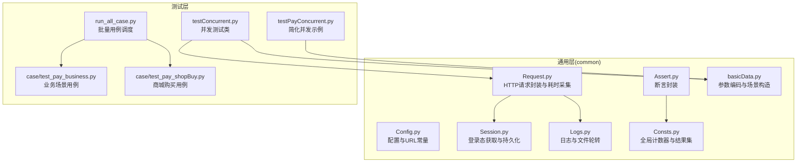
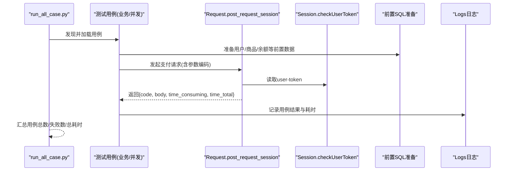
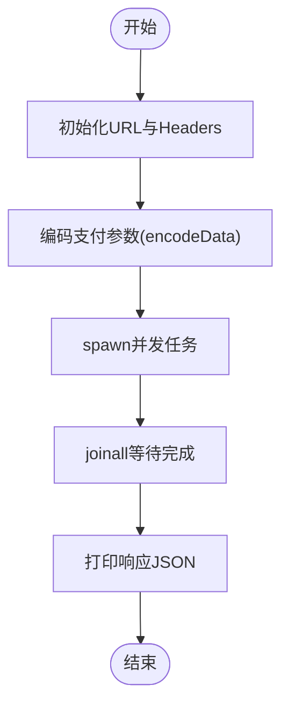
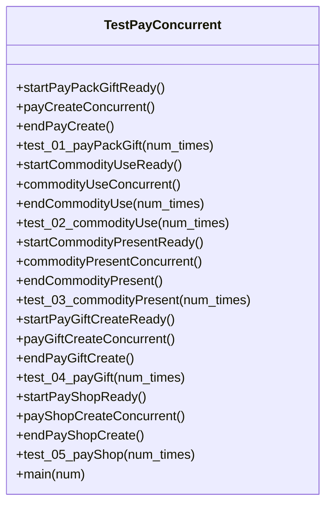
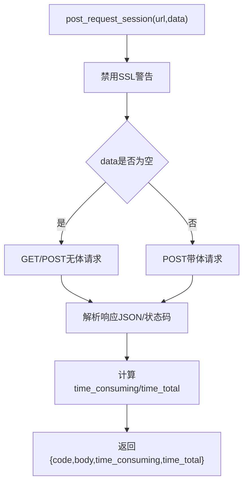
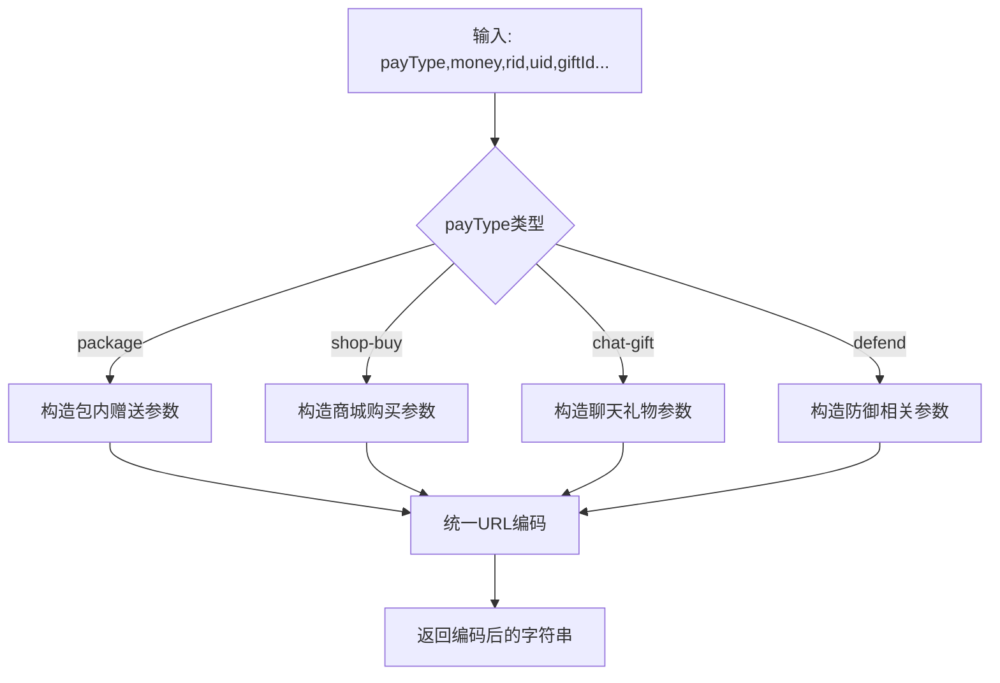
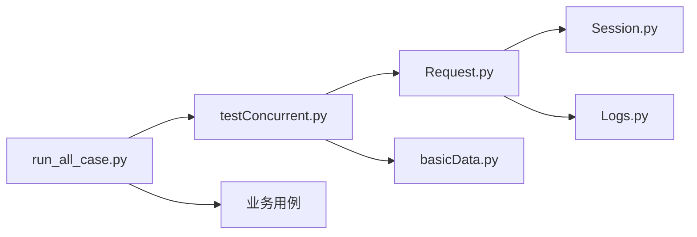

# 性能测试

<cite>
**本文引用的文件**   
- [README.md](file://README.md)
- [requirements.txt](file://requirements.txt)
- [run_all_case.py](file://run_all_case.py)
- [testConcurrent.py](file://testConcurrent.py)
- [testPayConcurrent.py](file://testPayConcurrent.py)
- [common/Config.py](file://common/Config.py)
- [common/Consts.py](file://common/Consts.py)
- [common/basicData.py](file://common/basicData.py)
- [common/Request.py](file://common/Request.py)
- [common/Session.py](file://common/Session.py)
- [common/Assert.py](file://common/Assert.py)
- [common/Logs.py](file://common/Logs.py)
- [case/test_pay_business.py](file://case/test_pay_business.py)
- [case/test_pay_shopBuy.py](file://case/test_pay_shopBuy.py)
</cite>

## 目录
1. [简介](#简介)
2. [项目结构](#项目结构)
3. [核心组件](#核心组件)
4. [架构总览](#架构总览)
5. [详细组件分析](#详细组件分析)
6. [依赖分析](#依赖分析)
7. [性能考虑](#性能考虑)
8. [故障排查指南](#故障排查指南)
9. [结论](#结论)
10. [附录](#附录)

## 简介
本技术文档面向QA支付测试自动化项目的性能测试能力，聚焦于如何基于现有测试框架与工具链开展支付系统的性能测试，包括目标与指标定义、测试方法与场景设计、性能监控与瓶颈定位、以及回归与容量规划建议。当前仓库已具备并发测试基础（gevent）、HTTP请求封装与响应耗时采集、数据库前置准备与断言校验、日志与通知集成等能力，可直接用于构建性能测试方案。

## 项目结构
项目采用按功能域划分的组织方式，其中与性能测试直接相关的模块集中在以下区域：
- common：通用基础设施（配置、请求、会话、断言、日志、常量）
- case / caseOversea / caseSlp / caseStarify：业务用例集合
- 根目录脚本：批量运行、并发测试入口

图表来源
- [run_all_case.py:126-147](file://run_all_case.py#L126-L147)
- [testConcurrent.py:17-281](file://testConcurrent.py#L17-L281)
- [testPayConcurrent.py:9-47](file://testPayConcurrent.py#L9-L47)
- [common/Request.py:17-59](file://common/Request.py#L17-L59)
- [common/basicData.py:8-325](file://common/basicData.py#L8-L325)
- [common/Session.py:19-183](file://common/Session.py#L19-L183)
- [common/Assert.py:11-96](file://common/Assert.py#L11-L96)
- [common/Logs.py:8-47](file://common/Logs.py#L8-L47)
- [common/Config.py:6-133](file://common/Config.py#L6-L133)

章节来源
- [README.md:1-38](file://README.md#L1-L38)
- [requirements.txt:23-27](file://requirements.txt#L23-L27)
- [run_all_case.py:126-147](file://run_all_case.py#L126-L147)

## 核心组件
- 配置与常量
  - 统一管理各环境域名、用户ID、房间ID、礼物ID、支付URL等，便于在不同场景切换与复用。
- 请求封装与耗时采集
  - 统一封装POST请求，自动注入user-token与UA，解析响应状态码、JSON体，并记录毫秒级与秒级耗时字段，为性能指标采集提供基础。
- 并发执行
  - 使用gevent协程并发发起请求，结合统一的参数编码与前置准备，快速构造高并发场景。
- 断言与结果统计
  - 提供断言封装与全局计数器，便于统计成功/失败次数，支撑性能结果汇总与报告。
- 日志与通知
  - 统一日志输出与文件轮转，便于性能测试结果归档与问题追踪；与机器人推送集成，便于告警。

章节来源
- [common/Config.py:6-133](file://common/Config.py#L6-L133)
- [common/Request.py:17-59](file://common/Request.py#L17-L59)
- [testConcurrent.py:17-281](file://testConcurrent.py#L17-L281)
- [common/Assert.py:11-96](file://common/Assert.py#L11-L96)
- [common/Consts.py:4-17](file://common/Consts.py#L4-L17)
- [common/Logs.py:8-47](file://common/Logs.py#L8-L47)

## 架构总览
下图展示了从调度到执行再到结果统计的端到端流程，重点标注了性能相关的关键节点（请求耗时、并发控制、结果汇总）。

图表来源
- [run_all_case.py:12-124](file://run_all_case.py#L12-L124)
- [testConcurrent.py:266-276](file://testConcurrent.py#L266-L276)
- [common/Request.py:17-59](file://common/Request.py#L17-L59)
- [common/Session.py:168-182](file://common/Session.py#L168-L182)

## 详细组件分析

### 并发测试类（TestPayConcurrent）
该类演示了如何使用gevent进行并发请求，适合快速搭建性能测试骨架。其核心要点：
- 使用g事件循环并发触发相同或不同请求
- 通过统一的参数编码函数构造payload
- 通过请求封装获取响应状态与耗时

图表来源
- [testPayConcurrent.py:18-41](file://testPayConcurrent.py#L18-L41)
- [common/basicData.py:8-40](file://common/basicData.py#L8-L40)

章节来源
- [testPayConcurrent.py:9-47](file://testPayConcurrent.py#L9-L47)
- [common/basicData.py:8-40](file://common/basicData.py#L8-L40)

### 支付并发测试类（TestPayConcurrent）
该类在通用并发基础上，结合业务前置准备与断言，形成可复用的并发测试模板：
- 前置准备：更新余额、清空背包、插入道具等
- 并发执行：通过gevent并发触发支付/使用/赠送等动作
- 结果校验：断言最终余额、背包数量、成功计数等
- 结果汇总：将每个场景的统计写入全局结果集并落盘

图表来源
- [testConcurrent.py:17-281](file://testConcurrent.py#L17-L281)

章节来源
- [testConcurrent.py:17-281](file://testConcurrent.py#L17-L281)

### 请求封装与耗时采集（Request.post_request_session）
- 自动注入user-token与UA，支持HTTPS
- 解析响应状态码与JSON体
- 记录毫秒级与秒级耗时，便于后续统计分析

图表来源
- [common/Request.py:17-59](file://common/Request.py#L17-L59)

章节来源
- [common/Request.py:17-59](file://common/Request.py#L17-L59)

### 参数编码与场景构造（basicData.encodeData）
- 提供多种支付场景的参数构造函数，覆盖包内赠送、商城购买、聊天礼物、防御道具等
- 统一进行URL编码处理，确保请求体格式正确

图表来源
- [common/basicData.py:8-325](file://common/basicData.py#L8-L325)

章节来源
- [common/basicData.py:8-325](file://common/basicData.py#L8-L325)

### 会话与登录态（Session）
- 提供getSession与checkUserToken，支持从登录接口获取token并持久化，便于并发场景复用
- 在并发测试中可先统一获取并写入token，再由请求封装读取使用

章节来源
- [common/Session.py:19-183](file://common/Session.py#L19-L183)

### 断言与结果统计（Assert/Consts）
- 断言封装支持状态码、相等性、范围、文本包含等
- 全局计数器用于统计成功/失败次数，便于性能场景下的成功率与错误率统计

章节来源
- [common/Assert.py:11-96](file://common/Assert.py#L11-L96)
- [common/Consts.py:4-17](file://common/Consts.py#L4-L17)

### 用例示例（业务与商城）
- 业务场景用例：验证商业房打赏、GS分成、VIP经验等
- 商城购买用例：验证购买、赠送、余额不足等边界

章节来源
- [case/test_pay_business.py:18-189](file://case/test_pay_business.py#L18-L189)
- [case/test_pay_shopBuy.py:20-124](file://case/test_pay_shopBuy.py#L20-L124)

## 依赖分析
- 运行时依赖
  - gevent：协程并发执行
  - requests：HTTP请求
  - PyMySQL/redis等：数据库与缓存访问（在前置SQL与断言中使用）
- 项目内依赖
  - 测试用例依赖common层的配置、请求、断言、日志、常量
  - 并发测试类依赖参数编码与请求封装

图表来源
- [requirements.txt:23-27](file://requirements.txt#L23-L27)
- [common/Request.py:17-59](file://common/Request.py#L17-L59)
- [testConcurrent.py:17-281](file://testConcurrent.py#L17-L281)
- [run_all_case.py:126-147](file://run_all_case.py#L126-L147)

章节来源
- [requirements.txt:23-27](file://requirements.txt#L23-L27)
- [common/Request.py:17-59](file://common/Request.py#L17-L59)
- [testConcurrent.py:17-281](file://testConcurrent.py#L17-L281)
- [run_all_case.py:126-147](file://run_all_case.py#L126-L147)

## 性能考虑
- 目标与指标
  - 响应时间：平均响应时间、P95/P99响应时间
  - 吞吐量：每秒事务数（TPS）、每秒请求数（RPS）
  - 资源利用率：CPU、内存、网络、数据库连接池占用
  - 稳定性：错误率、超时率、成功率、P95-P99时延抖动
- 场景设计原则
  - 负载模式：阶梯式加压、恒定并发、突发流量
  - 压力测试：逐步提升并发数直至SLA告警或错误率上升
  - 容量规划：识别瓶颈（接口、数据库、缓存、第三方依赖），评估扩容阈值
- 基线与阈值
  - 基线：在稳定环境下采集平均/95分位响应时间、错误率、资源使用率
  - 阈值：为平均响应时间、P95/P99、错误率、资源上限设定阈值
- 回归策略
  - 将关键路径用例纳入回归，持续监控趋势变化
  - 对热点接口建立独立的性能回归套件

[本节为通用指导，无需列出具体文件来源]

## 故障排查指南
- 常见问题
  - 登录态失效：检查Session.token读取与写入流程，确认token有效期与刷新策略
  - SSL证书与网络：请求封装已禁用SSL警告，若出现连接异常需检查代理与证书
  - 数据不一致：并发场景下需确保前置SQL幂等与隔离，避免竞态条件
  - 错误率升高：关注P95/P99时延突增，定位慢查询与外部依赖
- 排查步骤
  - 查看日志：定位失败用例与异常堆栈
  - 复现实验：缩小并发规模复现，逐步放大
  - 抽样分析：对慢请求采样，分析关键链路耗时
  - 资源监控：结合系统与应用指标，判断是否为资源瓶颈

章节来源
- [common/Session.py:168-182](file://common/Session.py#L168-L182)
- [common/Request.py:25-47](file://common/Request.py#L25-L47)
- [common/Logs.py:8-47](file://common/Logs.py#L8-L47)

## 结论
本项目已具备构建支付系统性能测试的基础能力：并发执行、请求耗时采集、参数编码、断言与结果统计、日志与通知。建议在此基础上补充独立的性能测试脚本，明确指标与阈值，完善资源监控与回归策略，形成可重复、可观测、可追溯的性能测试体系，为生产环境调优提供数据支撑。

[本节为总结性内容，无需列出具体文件来源]

## 附录

### 性能测试实施清单
- 明确目标与指标（响应时间、吞吐量、错误率、资源利用率）
- 设计场景（负载模式、压力测试、容量规划）
- 建立基线与阈值（平均/P95/P99、错误率、资源上限）
- 编排并发脚本（基于gevent与参数编码）
- 采集与可视化（日志+指标+报告）
- 回归与容量规划（持续集成、阈值告警）

[本节为通用指导，无需列出具体文件来源]