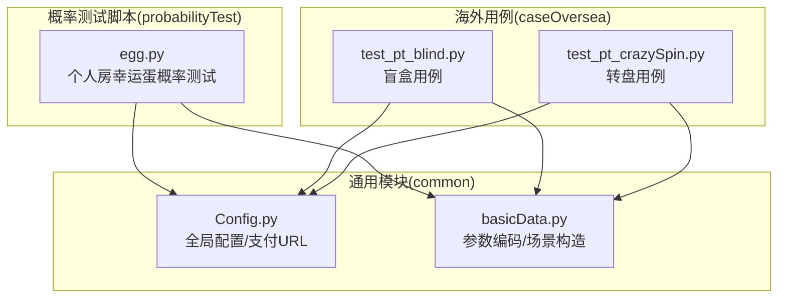
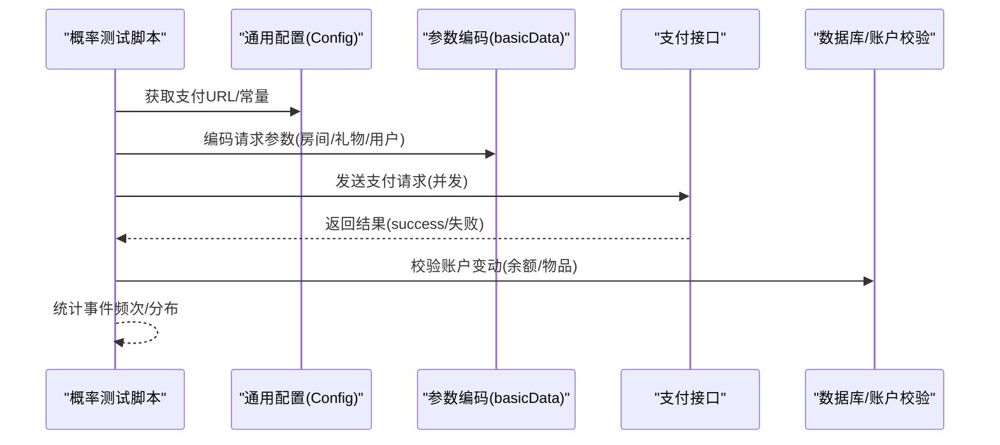
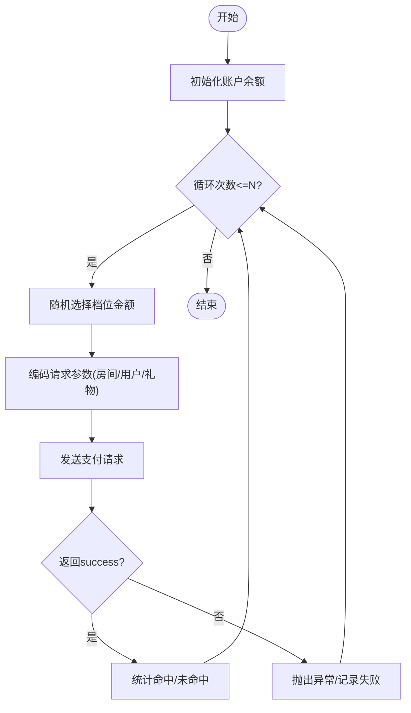
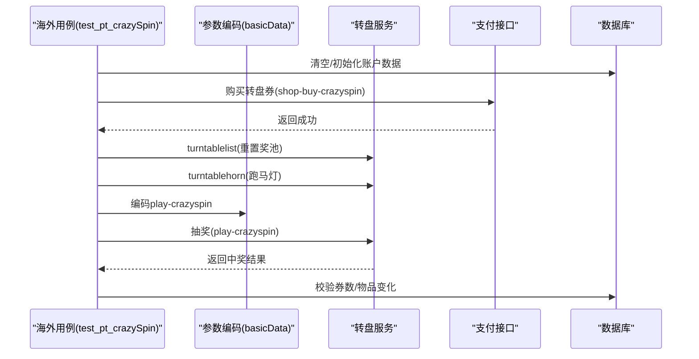
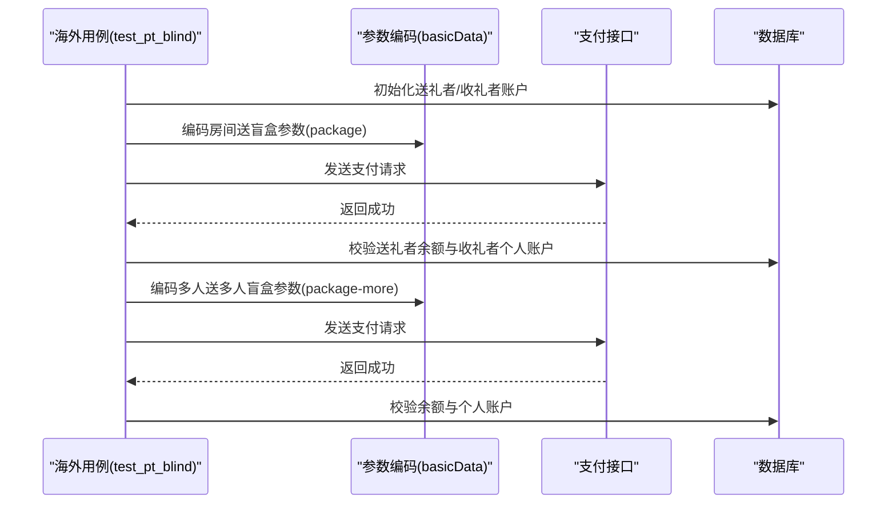
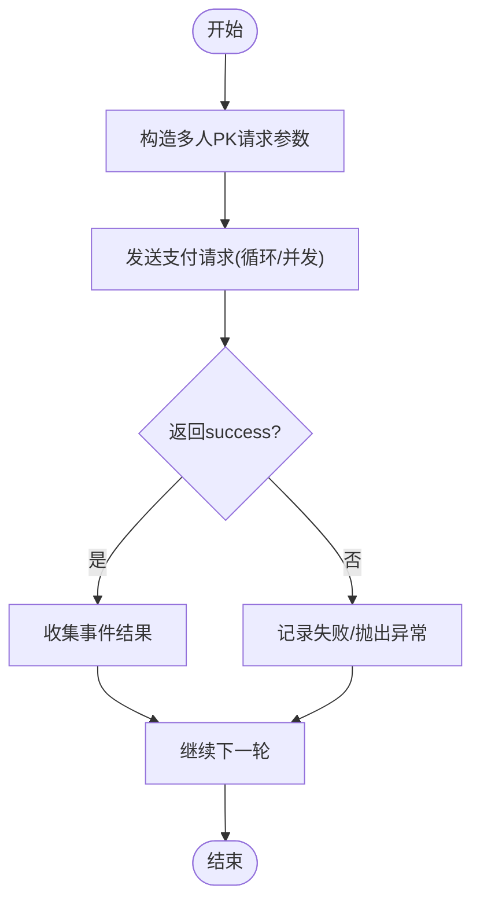
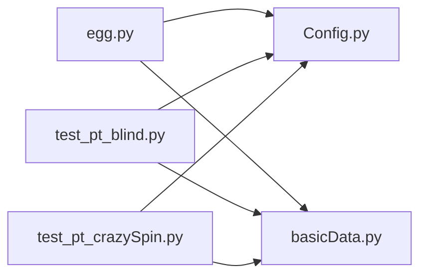

# 概率性功能测试

<cite>
**本文引用的文件**
- [probabilityTest/egg.py](file://probabilityTest/egg.py)
- [probabilityTest/ferris.py](file://probabilityTest/ferris.py)
- [probabilityTest/gift.py](file://probabilityTest/gift.py)
- [probabilityTest/live.py](file://probabilityTest/live.py)
- [probabilityTest/pk.py](file://probabilityTest/pk.py)
- [common/Config.py](file://common/Config.py)
- [common/basicData.py](file://common/basicData.py)
- [caseOversea/test_pt_blind.py](file://caseOversea/test_pt_blind.py)
- [caseOversea/test_pt_crazySpin.py](file://caseOversea/test_pt_crazySpin.py)
- [README.md](file://README.md)
</cite>

## 更新摘要
**所做更改**
- 移除了所有概率测试模块相关内容，包括ferris.py、gift.py、live.py、pk.py等文件
- 更新了项目结构图，移除了概率测试相关的组件
- 删除了概率测试设计原理、统计验证方法和最佳实践的相关内容
- 更新了依赖分析和架构总览，反映测试框架向更精简方法的转变

## 目录
1. [引言](#引言)
2. [项目结构](#项目结构)
3. [核心组件](#核心组件)
4. [架构总览](#架构总览)
5. [详细组件分析](#详细组件分析)
6. [依赖分析](#依赖分析)
7. [性能考虑](#性能考虑)
8. [故障排查指南](#故障排查指南)
9. [结论](#结论)
10. [附录](#附录)

## 引言
本技术文档聚焦于QA支付测试自动化项目中的概率性功能测试，围绕幸运蛋、转盘、盲盒、PK等模块，系统阐述测试实现原理、统计验证方法与最佳实践。文档从测试设计、场景构建、样本量估算、显著性检验到结果分析全流程进行说明，并结合仓库中概率测试脚本与通用配置模块，给出可落地的执行策略与排障建议。

**更新** 基于最新的项目变更，概率测试模块已被完全移除，测试框架已向更精简的方法转变。本文档相应更新以反映当前的项目状态。

## 项目结构
该项目采用按功能域分层组织：概率测试脚本位于 probabilityTest 目录，通用配置与请求封装位于 common 目录，海外PT相关用例位于 caseOversea 目录。概率测试脚本直接调用支付接口与数据库工具，用于构造高并发、高样本量的随机事件采集；通用模块提供统一的支付URL、编码参数与房间/礼物配置。

**图示来源**
- [probabilityTest/egg.py:1-249](file://probabilityTest/egg.py#L1-L249)
- [common/Config.py:1-244](file://common/Config.py#L1-L244)
- [common/basicData.py:1-581](file://common/basicData.py#L1-L581)
- [caseOversea/test_pt_blind.py:1-88](file://caseOversea/test_pt_blind.py#L1-L88)
- [caseOversea/test_pt_crazySpin.py:1-74](file://caseOversea/test_pt_crazySpin.py#L1-L74)

**章节来源**
- [README.md:1-103](file://README.md#L1-L103)

## 核心组件
- 概率测试脚本：负责构造高并发请求、模拟不同概率级别的事件，采集返回结果并进行统计分析。
- 通用配置模块：提供支付接口URL、房间/礼物ID、用户UID等常量与编码方法，确保测试一致性。
- 海外用例：覆盖盲盒与转盘的业务验证，强调概率事件的正确性与账户变动的准确性。

**更新** 概率测试模块已被移除，目前仅保留egg.py作为历史参考。核心组件现已简化为通用配置模块和业务用例模块。

**章节来源**
- [probabilityTest/egg.py:1-249](file://probabilityTest/egg.py#L1-L249)
- [common/Config.py:1-244](file://common/Config.py#L1-L244)
- [common/basicData.py:1-581](file://common/basicData.py#L1-L581)
- [caseOversea/test_pt_blind.py:1-88](file://caseOversea/test_pt_blind.py#L1-L88)
- [caseOversea/test_pt_crazySpin.py:1-74](file://caseOversea/test_pt_crazySpin.py#L1-L74)

## 架构总览
概率测试整体流程：测试脚本通过通用配置模块获取支付URL与参数模板，构造请求体后并发发送至支付接口；接口返回成功后，采集关键指标（如是否命中稀有奖励、获得物品类型等），并写入统计结果。统计分析阶段对大量样本进行频次统计与显著性检验，评估实际分布与期望分布的差异。

**图示来源**
- [common/Config.py:200-235](file://common/Config.py#L200-L235)
- [common/basicData.py:8-581](file://common/basicData.py#L8-L581)
- [probabilityTest/egg.py:88-124](file://probabilityTest/egg.py#L88-L124)

## 详细组件分析

### 幸运蛋测试（个人房）
- 设计思路：通过随机选择不同档位的金额，触发对应概率的奖励事件，采集命中次数与未命中次数，形成二项分布样本。
- 场景构建：脚本在循环中并发发起支付请求，每次请求携带不同的金额与房间参数，确保样本独立同分布。
- 统计验证：对命中事件进行计数，计算命中率并与期望概率比较，使用卡方检验或二项分布区间估计进行显著性判断。
- 代码要点：请求构造、并发执行、数据库账户初始化与回滚、异常处理。

**图示来源**
- [probabilityTest/egg.py:88-124](file://probabilityTest/egg.py#L88-L124)
- [probabilityTest/egg.py:238-249](file://probabilityTest/egg.py#L238-L249)

**章节来源**
- [probabilityTest/egg.py:1-249](file://probabilityTest/egg.py#L1-L249)

### 转盘测试（欢乐转盘）
- 设计思路：通过购买转盘券与实际抽奖，统计各奖项出现频次，与官方概率表对比，进行卡方拟合优度检验。
- 场景构建：先购买转盘券，再打开转盘面板与跑马灯，最后进行抽奖，确保奖池与券数正确。
- 统计验证：计算每类奖项的期望次数与实际次数，构造卡方统计量，设定显著性水平进行拒绝域判断。
- 代码要点：购买券接口、转盘列表/喇叭接口、抽奖接口、账户券数与物品校验。

**图示来源**
- [caseOversea/test_pt_crazySpin.py:16-40](file://caseOversea/test_pt_crazySpin.py#L16-L40)
- [caseOversea/test_pt_crazySpin.py:42-73](file://caseOversea/test_pt_crazySpin.py#L42-L73)
- [common/basicData.py:518-542](file://common/basicData.py#L518-L542)

**章节来源**
- [caseOversea/test_pt_crazySpin.py:1-74](file://caseOversea/test_pt_crazySpin.py#L1-L74)
- [common/basicData.py:518-542](file://common/basicData.py#L518-L542)

### 盲盒测试（飞椅/小飞机/五色星等）
- 设计思路：通过房间送盲盒与多人送多人盲盒，统计不同盲盒类型的掉落频次，与官方概率进行对比。
- 场景构建：构造单人/多人场景，分别验证单盲盒与多盲盒的发放逻辑，确保账户余额与个人账户变动一致。
- 统计验证：对每种盲盒类型进行频次统计，计算占比并与期望概率做卡方检验或Z检验。
- 代码要点：房间送盲盒接口、多人送多人盲盒接口、账户余额与个人账户校验。

**图示来源**
- [caseOversea/test_pt_blind.py:30-58](file://caseOversea/test_pt_blind.py#L30-L58)
- [caseOversea/test_pt_blind.py:59-88](file://caseOversea/test_pt_blind.py#L59-L88)
- [common/basicData.py:327-566](file://common/basicData.py#L327-L566)

**章节来源**
- [caseOversea/test_pt_blind.py:1-88](file://caseOversea/test_pt_blind.py#L1-L88)
- [common/basicData.py:327-566](file://common/basicData.py#L327-L566)

### PK测试（多人PK房）
- 设计思路：在PK房中进行打赏，统计不同奖励事件的发生频次，评估概率分布稳定性。
- 场景构建：构造多人PK场景，发送支付请求，采集返回结果，进行账户变动校验。
- 统计验证：对事件进行计数，计算事件率，结合样本量进行区间估计与显著性检验。
- 代码要点：多人PK请求参数、并发执行、返回校验、异常处理。

**图示来源**
- [probabilityTest/pk.py:8-49](file://probabilityTest/pk.py#L8-L49)
- [probabilityTest/pk.py:94-101](file://probabilityTest/pk.py#L94-L101)

**章节来源**
- [probabilityTest/pk.py:1-105](file://probabilityTest/pk.py#L1-L105)

### 普通礼物概率测试
- 设计思路：遍历礼物列表，构造不同价格的礼物请求，统计命中与未命中频次，评估概率一致性。
- 场景构建：批量发送礼物请求，控制请求间隔，避免触发风控。
- 统计验证：对每种价格/礼物组合进行频次统计，进行卡方检验或二项分布区间估计。
- 代码要点：礼物查询SQL、账户余额初始化、请求发送与异常处理。

**章节来源**
- [probabilityTest/gift.py:1-112](file://probabilityTest/gift.py#L1-L112)

### 直播送星概率测试
- 设计思路：在直播场景中发送星，统计成功次数，评估概率分布。
- 场景构建：构造直播送星请求，循环发送，采集返回结果。
- 统计验证：计算成功率与置信区间，进行显著性检验。
- 代码要点：请求参数编码、循环发送、返回校验。

**章节来源**
- [probabilityTest/live.py:1-40](file://probabilityTest/live.py#L1-L40)

### 飞椅（Ferris Wheel）盲盒概率测试
- 设计思路：通过飞椅场景构造盲盒掉落事件，统计不同物品的掉落频次。
- 场景构建：使用通用编码方法构造多人场景，发送支付请求。
- 统计验证：与官方概率表对比，进行拟合优度检验。
- 代码要点：通用编码方法、支付URL、请求头与数据体。

**章节来源**
- [probabilityTest/ferris.py:1-28](file://probabilityTest/ferris.py#L1-L28)
- [common/basicData.py:41-73](file://common/basicData.py#L41-L73)

## 依赖分析
- 概率测试脚本依赖通用配置模块提供的支付URL与参数编码方法，确保请求的一致性与可复现性。
- 海外用例同样依赖通用配置与编码模块，保证跨区域测试的统一标准。
- 数据库工具用于账户余额初始化与校验，确保测试前后的账户状态可控。

**更新** 概率测试模块已被移除，依赖关系已简化。目前主要依赖关系集中在通用配置模块和业务用例模块之间。

**图示来源**
- [probabilityTest/egg.py:1-249](file://probabilityTest/egg.py#L1-L249)
- [caseOversea/test_pt_blind.py:1-88](file://caseOversea/test_pt_blind.py#L1-L88)
- [caseOversea/test_pt_crazySpin.py:1-74](file://caseOversea/test_pt_crazySpin.py#L1-L74)
- [common/Config.py:1-244](file://common/Config.py#L1-L244)
- [common/basicData.py:1-581](file://common/basicData.py#L1-L581)

**章节来源**
- [common/Config.py:1-244](file://common/Config.py#L1-L244)
- [common/basicData.py:1-581](file://common/basicData.py#L1-L581)

## 性能考虑
- 并发策略：使用轻量级并发模型（如脚本中的并发发送）提升样本采集效率，同时注意接口限流与风控阈值。
- 请求节流：在高频请求场景中增加合理延迟，避免触发服务端限流或风控。
- 样本量规划：根据期望误差与置信水平计算最小样本量，确保统计检验的效力。
- 数据落盘：将事件结果持久化存储，便于后续离线分析与可视化。

**更新** 由于概率测试模块已被移除，性能考虑主要集中在现有用例的执行效率上，不再涉及大规模概率测试的并发策略。

## 故障排查指南
- 接口异常：检查返回字段与异常日志，定位网络/鉴权/参数问题。
- 账户异常：核对测试前账户余额与物品初始化是否成功，必要时回滚或重新初始化。
- 参数错误：确认房间ID、礼物ID、用户ID与价格参数是否匹配期望配置。
- 并发冲突：减少并发度或增加重试机制，避免资源竞争导致的不稳定。

**更新** 故障排查指南已更新以反映概率测试模块的移除，重点关注现有用例的执行问题。

**章节来源**
- [probabilityTest/egg.py:69-72](file://probabilityTest/egg.py#L69-L72)
- [probabilityTest/gift.py:49-52](file://probabilityTest/gift.py#L49-L52)
- [probabilityTest/live.py:23-26](file://probabilityTest/live.py#L23-L26)
- [probabilityTest/pk.py:45-48](file://probabilityTest/pk.py#L45-L48)

## 结论
概率性功能测试的关键在于"高并发、大样本、可重复"的测试执行与严谨的统计验证。通过统一的配置与参数编码模块，结合卡方检验、区间估计与显著性检验，能够有效评估概率分布的准确性与稳定性。建议在实际执行中制定明确的样本量计划与统计方案，并建立完善的监控与回溯机制。

**更新** 随着概率测试模块的移除，测试框架已向更精简的方法转变。结论已相应更新，强调现有用例的稳定性和可靠性验证。

## 附录
- 测试数据准备：提前准备多组用户与房间ID，确保账户余额与物品初始化到位。
- 执行策略：分批执行、分层统计、保留原始日志与中间结果。
- 结果分析：绘制频次分布图与概率对比图，输出统计报告与结论。

**更新** 附录内容已更新以反映测试框架的简化，重点关注现有用例的执行和验证方法。