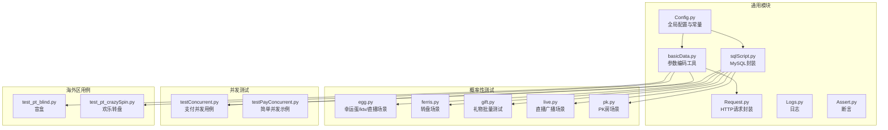
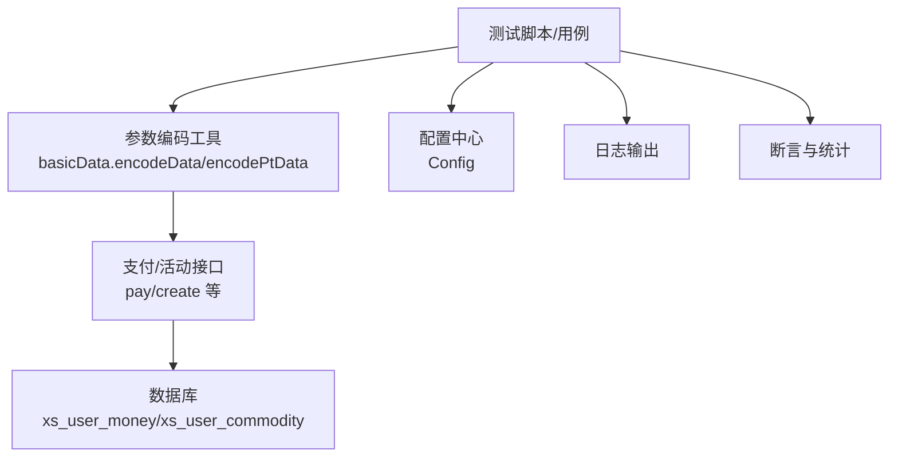
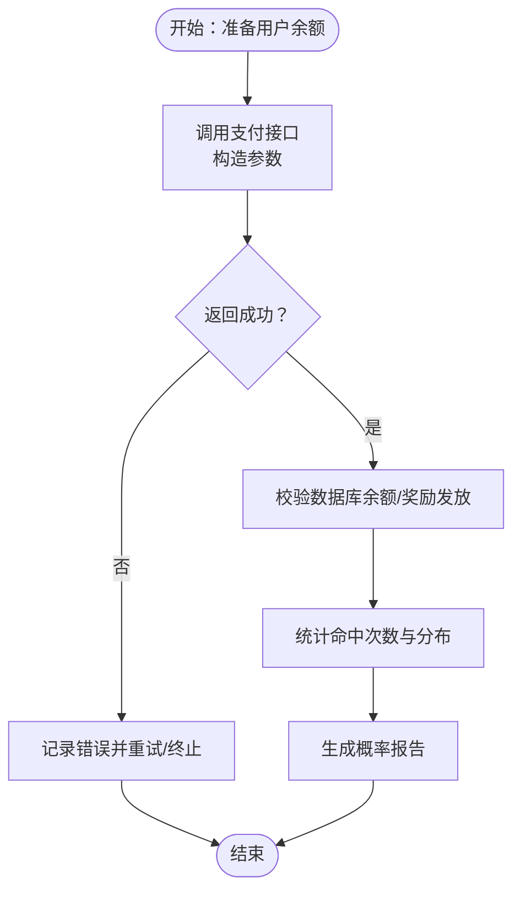
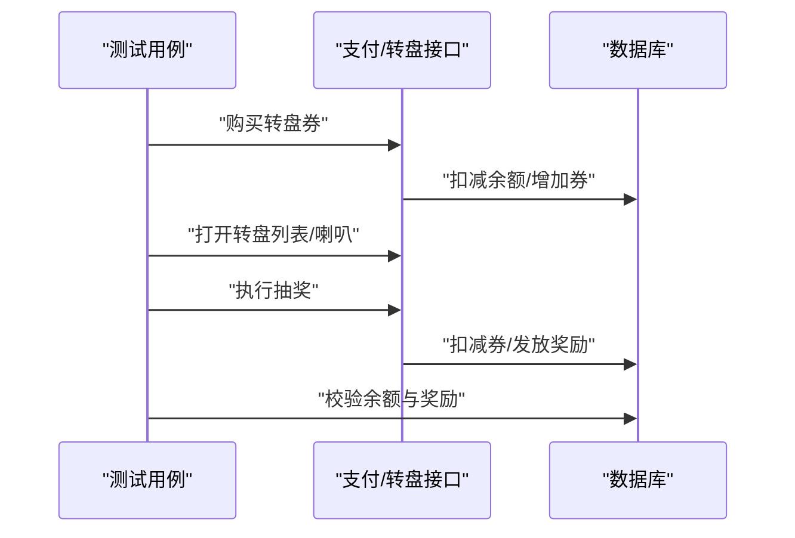
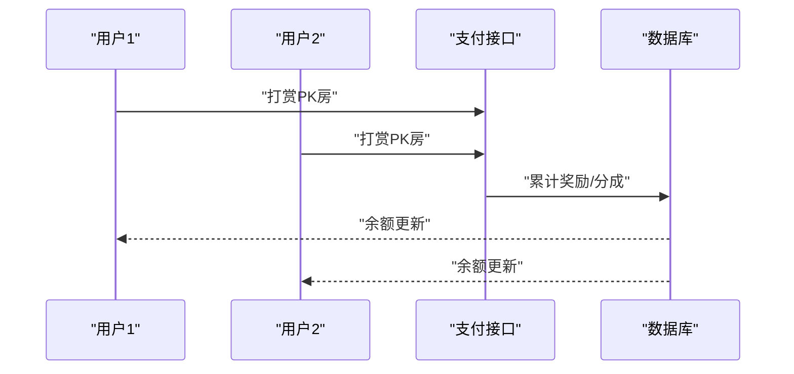
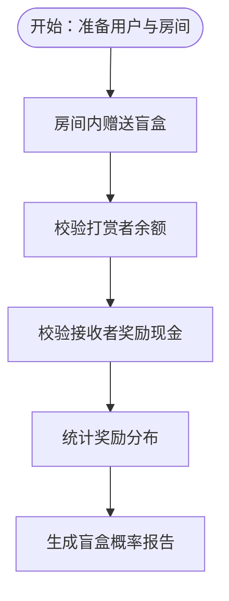
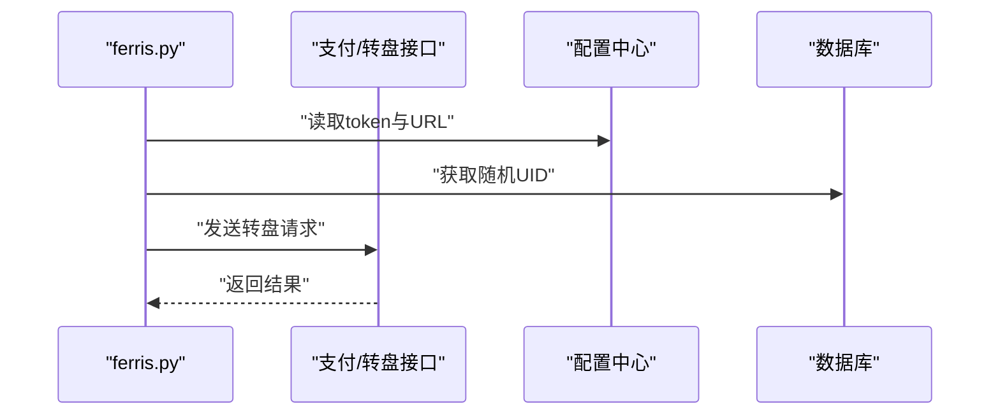
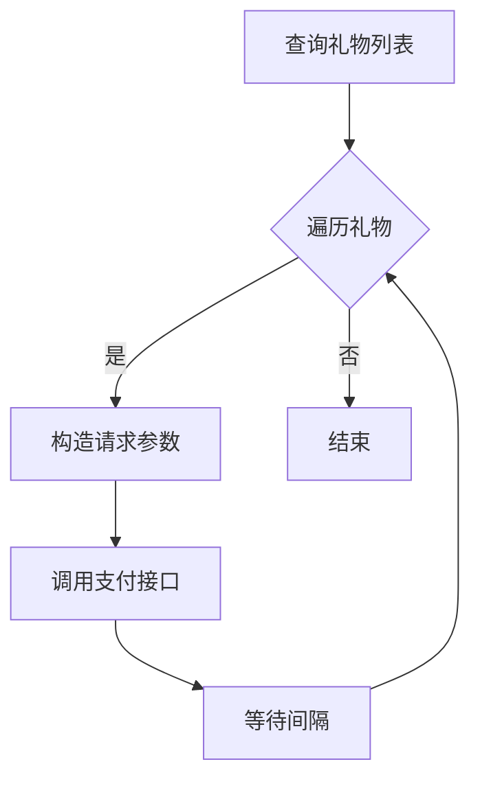
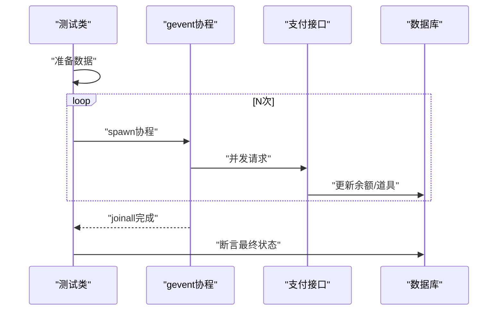
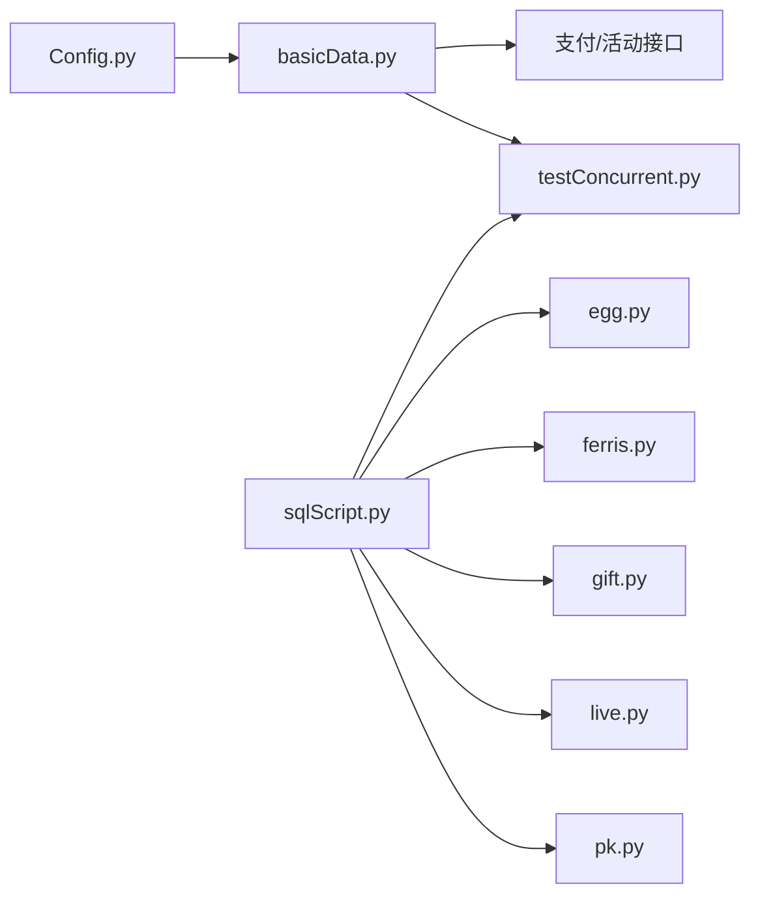

# 高级功能测试

<cite>
**本文引用的文件**
- [README.md](file://README.md)
- [probabilityTest/egg.py](file://probabilityTest/egg.py)
- [probabilityTest/ferris.py](file://probabilityTest/ferris.py)
- [probabilityTest/gift.py](file://probabilityTest/gift.py)
- [probabilityTest/live.py](file://probabilityTest/live.py)
- [probabilityTest/pk.py](file://probabilityTest/pk.py)
- [testConcurrent.py](file://testConcurrent.py)
- [testPayConcurrent.py](file://testPayConcurrent.py)
- [common/Config.py](file://common/Config.py)
- [common/sqlScript.py](file://common/sqlScript.py)
- [common/basicData.py](file://common/basicData.py)
- [caseOversea/test_pt_blind.py](file://caseOversea/test_pt_blind.py)
- [caseOversea/test_pt_crazySpin.py](file://caseOversea/test_pt_crazySpin.py)
</cite>

## 目录
1. [简介](#简介)
2. [项目结构](#项目结构)
3. [核心组件](#核心组件)
4. [架构总览](#架构总览)
5. [详细组件分析](#详细组件分析)
6. [依赖关系分析](#依赖关系分析)
7. [性能考虑](#性能考虑)
8. [故障排查指南](#故障排查指南)
9. [结论](#结论)
10. [附录](#附录)

## 简介
本文件面向QA支付测试自动化项目的“高级功能测试”，系统化阐述概率性功能测试（幸运蛋、转盘、PK、盲盒等）、并发测试与性能测试的实现方法、最佳实践与扩展指南。内容覆盖测试策略、统计验证、并发设计与执行、性能指标与瓶颈分析、高级场景配置与数据准备、结果验证与报告生成。

## 项目结构
该项目采用分层与按功能域划分的组织方式：
- common：通用基础设施（配置、请求封装、数据库操作、编码工具、日志与断言等）
- probabilityTest：概率性功能测试脚本（独立运行，便于快速验证）
- caseOversea：海外区业务用例（含盲盒、转盘等高级玩法）
- testConcurrent/testPayConcurrent：并发测试样例（gevent协程并发）

图表来源
- [common/Config.py:1-133](file://common/Config.py#L1-L133)
- [common/sqlScript.py:1-145](file://common/sqlScript.py#L1-L145)
- [common/basicData.py:1-581](file://common/basicData.py#L1-L581)
- [probabilityTest/egg.py:1-259](file://probabilityTest/egg.py#L1-L259)
- [probabilityTest/ferris.py:1-28](file://probabilityTest/ferris.py#L1-L28)
- [probabilityTest/gift.py:1-112](file://probabilityTest/gift.py#L1-L112)
- [probabilityTest/live.py:1-40](file://probabilityTest/live.py#L1-L40)
- [probabilityTest/pk.py:1-105](file://probabilityTest/pk.py#L1-L105)
- [testConcurrent.py:1-281](file://testConcurrent.py#L1-L281)
- [testPayConcurrent.py:1-47](file://testPayConcurrent.py#L1-L47)
- [caseOversea/test_pt_blind.py:1-88](file://caseOversea/test_pt_blind.py#L1-L88)
- [caseOversea/test_pt_crazySpin.py:1-74](file://caseOversea/test_pt_crazySpin.py#L1-L74)

章节来源
- [README.md:1-38](file://README.md#L1-L38)

## 核心组件
- 配置与常量：集中管理环境地址、用户/房间/礼物ID、比例参数等，确保测试用例可复用与可维护。
- 数据编码工具：统一构造支付请求参数，支持多种场景（单人/多人、商城购买、转盘、盲盒等）。
- MySQL封装：提供余额更新、背包操作、查询等能力，支撑概率性测试的数据准备与结果校验。
- 请求封装：统一封装HTTP请求，支持带token的会话请求。
- 日志与断言：统一输出与断言，便于结果统计与失败重试。

章节来源
- [common/Config.py:1-133](file://common/Config.py#L1-L133)
- [common/basicData.py:1-581](file://common/basicData.py#L1-L581)
- [common/sqlScript.py:1-145](file://common/sqlScript.py#L1-L145)
- [common/Request.py:1-200](file://common/Request.py#L1-L200)
- [common/Assert.py:1-200](file://common/Assert.py#L1-L200)

## 架构总览
下图展示高级功能测试的整体交互：测试脚本通过编码工具构造请求，调用支付/转盘/盲盒等接口，数据库用于准备初始数据与校验结果；概率性测试可独立运行，也可集成到并发与性能测试中。

图表来源
- [common/basicData.py:1-581](file://common/basicData.py#L1-L581)
- [common/Config.py:1-133](file://common/Config.py#L1-L133)
- [common/sqlScript.py:1-145](file://common/sqlScript.py#L1-L145)

## 详细组件分析

### 幸运蛋测试（概率性功能）
- 场景目标：验证个人房/ktv/直播场景下的幸运蛋触发与奖励发放是否符合预期。
- 实现要点：
  - 数据准备：通过MySQL更新用户余额，确保有足够资金进行测试。
  - 接口调用：构造支付请求参数，调用支付接口完成赠送或购买流程。
  - 结果校验：检查返回状态与数据库余额变化，确保奖励发放正确。
- 统计验证建议：
  - 记录N次触发后的奖励分布，计算期望与实际差异，结合卡方检验评估是否显著偏离。
  - 对不同等级/价格档位分别统计命中率，形成区间置信度。
- 最佳实践：
  - 使用独立测试环境与隔离用户，避免并发干扰。
  - 设置最小样本量与显著性水平，保证统计结论可靠。

图表来源
- [probabilityTest/egg.py:1-259](file://probabilityTest/egg.py#L1-L259)
- [common/sqlScript.py:1-145](file://common/sqlScript.py#L1-L145)

章节来源
- [probabilityTest/egg.py:1-259](file://probabilityTest/egg.py#L1-L259)

### 转盘测试（欢乐转盘/大转盘）
- 场景目标：验证购买转盘券与抽奖流程，确保券扣减与奖励发放一致。
- 实现要点：
  - 购买环节：通过商城购买接口获得转盘券，校验余额与背包变化。
  - 抽奖环节：打开转盘列表/喇叭等前置接口，再进行抽奖，校验券扣减与奖励下发。
- 统计验证建议：
  - 记录多次抽奖的奖励分布，与配置的奖池权重对比，进行一致性检验。
  - 分析稀有奖励出现频率，评估是否符合设定概率。
- 最佳实践：
  - 在测试前清理用户背包，确保初始状态一致。
  - 使用固定随机种子或控制环境，减少随机波动影响。

图表来源
- [caseOversea/test_pt_crazySpin.py:1-74](file://caseOversea/test_pt_crazySpin.py#L1-L74)
- [common/basicData.py:518-542](file://common/basicData.py#L518-L542)

章节来源
- [caseOversea/test_pt_crazySpin.py:1-74](file://caseOversea/test_pt_crazySpin.py#L1-L74)
- [common/basicData.py:518-542](file://common/basicData.py#L518-L542)

### PK测试（多人对抗）
- 场景目标：验证PK房多人同时打赏/赠送的并发一致性与奖励分配。
- 实现要点：
  - 构造多人用户与房间信息，调用支付接口完成打赏。
  - 校验被打赏者余额与奖励累计是否符合预期分成比例。
- 统计验证建议：
  - 记录多人打赏序列，核对累计奖励与分成比例，确保无重复计数或遗漏。
  - 对不同角色（房主、房管、普通用户）分别统计，评估分配公平性。

图表来源
- [probabilityTest/pk.py:1-105](file://probabilityTest/pk.py#L1-L105)
- [common/Config.py:57-88](file://common/Config.py#L57-L88)

章节来源
- [probabilityTest/pk.py:1-105](file://probabilityTest/pk.py#L1-L105)
- [common/Config.py:57-88](file://common/Config.py#L57-L88)

### 盲盒测试（概率性功能）
- 场景目标：验证房间内赠送盲盒的流程与奖励发放，支持单人与多人场景。
- 实现要点：
  - 单人场景：校验赠送后打赏者余额与接收者奖励现金余额变化。
  - 多人场景：校验多人同时接收时的奖励累计与平衡。
- 统计验证建议：
  - 记录N次赠送后的奖励分布，与盲盒概率表对比，进行拟合优度检验。
  - 区分不同盲盒类型（如小飞机/飞马），分别统计命中率。

图表来源
- [caseOversea/test_pt_blind.py:1-88](file://caseOversea/test_pt_blind.py#L1-L88)
- [common/basicData.py:458-477](file://common/basicData.py#L458-L477)

章节来源
- [caseOversea/test_pt_blind.py:1-88](file://caseOversea/test_pt_blind.py#L1-L88)
- [common/basicData.py:458-477](file://common/basicData.py#L458-L477)

### 转盘测试（独立脚本）
- 场景目标：通过独立脚本验证转盘场景，使用编码工具与配置中心。
- 实现要点：
  - 获取随机用户UID集合，构造转盘请求参数并发起请求。
  - 输出响应结果，便于后续统计分析。

图表来源
- [probabilityTest/ferris.py:1-28](file://probabilityTest/ferris.py#L1-L28)
- [common/Config.py:1-133](file://common/Config.py#L1-L133)
- [common/sqlScript.py:125-145](file://common/sqlScript.py#L125-L145)

章节来源
- [probabilityTest/ferris.py:1-28](file://probabilityTest/ferris.py#L1-L28)

### 礼物批量测试（概率性功能）
- 场景目标：批量遍历礼物列表进行测试，验证不同价格档位的奖励发放。
- 实现要点：
  - 查询礼物列表与价格，循环构造请求并调用支付接口。
  - 更新用户余额，确保每次测试有足够的资金。

图表来源
- [probabilityTest/gift.py:1-112](file://probabilityTest/gift.py#L1-L112)
- [common/sqlScript.py:83-98](file://common/sqlScript.py#L83-L98)

章节来源
- [probabilityTest/gift.py:1-112](file://probabilityTest/gift.py#L1-L112)

### 直播广播测试（概率性功能）
- 场景目标：验证直播广播场景下的奖励触发与发放。
- 实现要点：
  - 构造广播请求参数，调用接口并校验返回状态。

章节来源
- [probabilityTest/live.py:1-40](file://probabilityTest/live.py#L1-L40)

### 并发测试（设计原理与执行）
- 设计原理：
  - 使用gevent协程并发，模拟高并发场景下的支付/赠送/使用道具等操作。
  - 通过统一的准备与收尾逻辑，确保并发前后数据状态一致。
- 执行方式：
  - 准备阶段：更新用户余额、清空背包、插入所需道具。
  - 并发阶段：批量spawn协程，统一join等待完成。
  - 收尾阶段：断言最终状态，记录结果并上报。
- 结果分析：
  - 统计成功/失败次数，计算成功率与吞吐量。
  - 关注竞态条件（如余额扣减、背包变更）的一致性。

图表来源
- [testConcurrent.py:1-281](file://testConcurrent.py#L1-L281)
- [testPayConcurrent.py:1-47](file://testPayConcurrent.py#L1-L47)

章节来源
- [testConcurrent.py:1-281](file://testConcurrent.py#L1-L281)
- [testPayConcurrent.py:1-47](file://testPayConcurrent.py#L1-L47)

### 性能测试（指标、场景与瓶颈分析）
- 指标定义：
  - 吞吐量：单位时间内完成的请求数（TPS）。
  - 响应时间：从请求发出到收到响应的耗时（P95/P99）。
  - 错误率：异常响应占比。
  - 资源占用：CPU/内存/连接数。
- 场景设计：
  - 稳定负载：维持恒定并发数，观察系统稳定性。
  - 突发负载：短时高并发冲击，评估峰值处理能力。
  - 渐进压力：逐步提升并发数，定位系统拐点。
- 瓶颈分析：
  - 接口层面：关注支付/转盘/盲盒等热点接口的延迟与错误。
  - 数据库层面：分析写入热点（余额/道具）与锁竞争。
  - 网络与外部依赖：第三方支付/消息队列等。

[本节为通用性能讨论，无需特定文件引用]

## 依赖关系分析
- 概率性测试依赖：
  - 配置中心：获取环境URL、用户/房间/礼物ID。
  - 编码工具：构造统一请求参数。
  - 数据库封装：准备与校验数据。
- 并发测试依赖：
  - 会话与请求封装：统一发起请求。
  - 断言与统计：汇总结果并上报。

图表来源
- [common/Config.py:1-133](file://common/Config.py#L1-L133)
- [common/basicData.py:1-581](file://common/basicData.py#L1-L581)
- [common/sqlScript.py:1-145](file://common/sqlScript.py#L1-L145)
- [probabilityTest/egg.py:1-259](file://probabilityTest/egg.py#L1-L259)
- [probabilityTest/ferris.py:1-28](file://probabilityTest/ferris.py#L1-L28)
- [probabilityTest/gift.py:1-112](file://probabilityTest/gift.py#L1-L112)
- [probabilityTest/live.py:1-40](file://probabilityTest/live.py#L1-L40)
- [probabilityTest/pk.py:1-105](file://probabilityTest/pk.py#L1-L105)
- [testConcurrent.py:1-281](file://testConcurrent.py#L1-L281)

章节来源
- [common/Config.py:1-133](file://common/Config.py#L1-L133)
- [common/basicData.py:1-581](file://common/basicData.py#L1-L581)
- [common/sqlScript.py:1-145](file://common/sqlScript.py#L1-L145)
- [probabilityTest/egg.py:1-259](file://probabilityTest/egg.py#L1-L259)
- [probabilityTest/ferris.py:1-28](file://probabilityTest/ferris.py#L1-L28)
- [probabilityTest/gift.py:1-112](file://probabilityTest/gift.py#L1-L112)
- [probabilityTest/live.py:1-40](file://probabilityTest/live.py#L1-L40)
- [probabilityTest/pk.py:1-105](file://probabilityTest/pk.py#L1-L105)
- [testConcurrent.py:1-281](file://testConcurrent.py#L1-L281)

## 性能考虑
- 并发模型选择：gevent协程适合I/O密集型场景，注意避免阻塞操作。
- 连接池与超时：合理设置HTTP连接池与超时，防止资源泄露。
- 数据准备批量化：批量更新用户余额与道具，减少事务开销。
- 统计口径标准化：统一采样窗口、显著性水平与置信区间，确保结果可比。

[本节为通用性能讨论，无需特定文件引用]

## 故障排查指南
- 常见问题：
  - 接口返回失败：检查请求参数、token有效性与网络连通性。
  - 余额不一致：确认并发场景下的幂等性与事务边界。
  - 统计偏差：扩大样本量、排除异常波动，必要时进行分层分析。
- 工具与手段：
  - 日志定位：利用统一日志模块输出关键步骤与参数。
  - 数据回溯：通过数据库审计与交易流水核对。
  - 失败重试：对偶发错误启用重试机制，避免误判。

章节来源
- [common/Logs.py:1-200](file://common/Logs.py#L1-L200)
- [common/runFailed.py:1-200](file://common/runFailed.py#L1-L200)

## 结论
本项目在概率性功能、并发与性能方面提供了可复用的基础设施与样例脚本。通过统一的参数编码、配置与数据库封装，能够高效构建高级测试场景；借助gevent协程并发与标准化断言，可稳定评估系统在高负载下的表现。建议在实际落地中进一步完善统计分析框架与报告生成机制，持续优化测试覆盖率与稳定性。

## 附录
- 高级测试场景配置参数建议：
  - 用户与房间：通过配置中心集中管理，确保跨场景一致性。
  - 礼物与盲盒：建立映射表，明确价格档位与概率权重。
  - 并发规模：从低到高逐步递增，记录拐点与异常。
- 数据准备与结果验证：
  - 使用数据库封装进行初始化与清理，确保测试隔离。
  - 对关键字段（余额、道具数量、奖励现金）进行双轨校验。
- 扩展新高级测试功能：
  - 新增场景：在编码工具中扩展参数构造，新增独立脚本或用例。
  - 统计分析：引入统计模块，支持卡方检验、置信区间等。
  - 报告生成：整合日志与断言结果，输出HTML报告或指标仪表板。

[本节为通用指导，无需特定文件引用]